# Java编程基础(第二阶段)

## Day-09 面向对象(高级)

- 类变量和类方法
- 理解main方法语法(static)
- 代码块
- 单例设计模式
- final关键字
- 抽象类
- 接口
- 内部类

### 0039 类变量和类方法

#### 类变量

- 类变量，也叫静态变量。用`static`修饰

- 特点，会被该类的**所有对象实例**共享

  ```java
  //定义一个变量 count ,是一个类变量(静态变量) static 静态
  //该变量最大的特点就是会被Child 类的所有的对象实例共享
  public static int count = 0;
  ```

  - 这个count是放在`堆`里面的

  - 在类加载的时候就生成，静态域中。保存在class实例的最后

    

- 什么是类变量

  - 类变量也叫静态变量/静态属性，是该类的所有对象共享的变量，任何一个该类的对象去访问它时取到的都是相同的值；同样任何一个该类的对象去修改它时，修改的也是同一个变量。这个从前面的图也可看出来。

- 如何定义类变量

  ```java
  访问修饰符 static 数据类型 变量名;//[推荐]
  static 访问修饰符 数据类型 变量名;
  ```

- 如何访问类变量VisitStatic.java

  - ```java
    类名.类变量名;
    //或者:
    对象名.类变量名;//【静态变量的访问修饰符的访问权限和范围和普通属性是样的。】
    ```

  - 推荐使用：`类名.类变量名`

- 类变量与实例变量(普通属性)区别

  - 类变量必须通过**static**修饰。
  - 类变量是该类的所有对象共享的，而实例变量是==实例的单个对象==独享的。
  - 实例变量不能通过**类名.类变量名**方式访问。
  - 类变量是在类加载时就初始化了，也就是说，即使你没有创建对象，只要类加载了，就可以使用类变量了。
  - 类变量的生命周期是随类的加载开始，随着类消亡而销毁。[Monster.name]

#### 类方法

- 类方法，也叫静态方法

- 定义方式

  ```java
  访问修饰符 static 数据类型 方法名(){};//[推荐]
  static 访问修饰符 数据类型 方法名(){};
  ```

- 类方法的调用

  - 和类变量一样，通过类名来调用

- 类方法经典的使用场景

  - 当方法中**不涉及到任何和对象相关的成员**，则可以将方法设计成静态方法提高开发效率
  - 该类方法拿来做工具类中的方法最合适。不用创建对象就可以调用该方法
  - 比如：工具类中的方法util
    - Math类、 Arrays类、 Colllections集合类看下源码
    - 其中：Array.sort();Math.sqrt();
  - 小结
    - 在程序员实际开发，往往会将一些通用的方法，设计成静态方法，这样我们不需要创建对象就可以使用了，比如打印一维数组，冒泡排序，完成某个计算任务等.[举例说明…

- 类方法使用细节

  - 类方法中不存在this；普通方法中隐藏着this的参数；
  - 类方法可以直接通过类名调用，也可以通过对象调用；
  - 类方法中==不允许使用和对象有关的关鍵字==，比如this和 super。普通方法(成员方法)可以。
  - 类方法(静态方法)中**只能访问**静态变量或静态方法。【如何理解】，==普通成员方法，既可以访问普通变量(方法)，也可以访问静态变量(方法)。==
  - 小结：静态方法，只能访问静态的成员，非静态的方法，可以访问静态成炅和非静态成员(必须遵守访问权限)

#### main方法

- 深入理解main方法

  - 解释main方法的形式: public static void main( String[]args){}

  1. main方法时虚拟机调用

  2. java虚拟机需要调用类的main()方法，所以该方法的访问权限必须是 public

  3. java虚拟机在执行main()方法时不必创建对象，所以该方法必须是 static

  4. 该方法接收 String类型的数组参数，该数组中保存执行java命令时传递给所运行的类的参数案例演示，接收参数

     - javac Hello

     - java Hello "tom"  "jack".这里的tom、jack就是传给args数组的元素，在运行的时候，通过dos命令行传进去.

       

     ```java
     public static void main(String[] args) {
     	for (int i = 0; i < args.length; i++) {
     	System.out.println(args[i]);
     }
     ```

  5. java 执行的程序 参数1 参数2 参数3.

  6. 在idea中传参要在这个位置

     

     - 运行结果

- main方法是一个静态方法，他的使用遵循类方法的规则，即只能调用静态成员。

  ```java
  private static int n=1999;
  int s = 900;
  public static void main(String[] args) {
      System.out.println(Main_.n);
      //        System.out.println(Main_.s);//不能访问非静态成员
      //通过创建对象访问
      Main_ main_ = new Main_();
      System.out.println(main_.s);
      for (int i = 0; i < args.length; i++) {
          System.out.println(args[i]);
      }
  }
  ```

  -----

### 0040 代码块

- 基本介绍

  - 代码化块又称为初始化块，属于类中的成员[即是类的一部分]，类似于方法，将逻辑语句封装在方法体中，通过包围起来。

  - 但和方法不同，没有方法名，没有返回，没有参数，只有方法体，而且不用通过对象或类显式调用，而是加载类时，或刨建对象时隐式调用。

  - 基本语法

    ```java
    [修饰符]{
    	代码
    }
    ```

  - 注意

    1. 修饰符可选，要写的话，也只能写 **static**
    2. 代码块分为两类，使用 static修饰的叫**静态代码块**，没有 static修饰的，叫**普通代码块**
    3. **逻辑语句**可以为任何逻辑语句(输入、输出、方法调用、循环、判断等)
    4. `;`号可以写上，也可以省略。

- 代码块的好处

  - (普通)代码块是对**构造器**的补充机制
  - ==假如类中有多个构造器，我们无论调用哪一个构造器，都会**优先**执行代码块中的内容，然后在执行构造器初始化中的内容==。

- 细节和注意事项

  1. static代码块也叫**静态代码块**，作用就是对类进行初始化，而且它随着==类的加载而执行==，并且**只会执行一次**。

     - 无论创建多少个对象，类只会被加载一次！！！！
     - 如果是==普通代码块==，每刨建一个对象，就执行一次。和**类**是否加载没有直接关系

  2. 类什么时候被加载✨

     ①创建对象实例时(new..,)

     ②创建子类对象实例时，父类也会被加载【父类先，子类后】

     ③使用类的静态成员时，

  3. 普通的代码块，在创建对象实例时，会被隐式的调用。被创建一次，就会调用一次。

     - 如果只是使用类的静态成员时，普通代码块并不会执行
     - 小结:1. static代码块是类加载时，执行，只会执行一次。普通代码块是在创建对象时调用的，创建一次，调用一次类加载的3种情况，需要记住

  4. 创建一个对象时，在一个**类调用顺序**是:(重点，难点)🎈

     ①**调用静态代码块和静态属性初始化**(注意:静态代码块和静态属性初始化调用的优先级一样，如果有多个静态代码块和多个静态变量初始化，则按他们定义的顺序调用)

     ②**调用普通代码块和普通属性的初始化**(注意:普通代码块和普通属性初始化调用的优先级一样，如果有多个普通代码块和多个普通属性初始化，则按定义顺序调用)

     ③**调用构造方法**

  5. 构造器的最前面其实隐含了 super()和调用普通代码块，**静态相关的代码块**，属性初始化，在类加载时，就执行完毕，因此是优先于构造器执行的。

  6. 我们看一下刨建一个子类时(继承关系)，他们的静态代码块，静态属性初始化，普通代码块，普通属性初始化，构造方法的调用顺序如下

     ①**父类**的==静态代码块和静态属性==(优先级一样，按定乂顺序执行)

     ②**子类**的==静态代码块和静态属性==(优先级一样，按定义顺序执行)

     ③**父类**的==普通==代码块和**普通**属性初始化(优先级一样，按定义顺序执行)

     ④**父类**的**构造方法**

     ⑤**子类**的**普通**代码块和**普通**属性初始化(优先级一样，按定义顺序执行)

     ⑥**子类**的**构造方法**∥/面试题
     A，B，C类演示[10Min]55 CodeblockDetail04java
     测试代码

      

  7. **静态**代码块只能直接调用**静态**成员(静态属性和静态方法)，==普通代码块可以调用任意成员==。

### 0041 单例设计模式

- 什么是单例设计模式

  - 所谓类的单例设计模式，就是采取一定的方法保证在整个的软件系统中对某个类只能**存在一个对象实例**，并且该类只提供一个取得其对象实例的方法；
  - 单例模式有两种方式:1)饿汉式2)懒汉式。

- 饿汉式

  1. 构造器私有化：防止直接new

  2. 类的内部创建对象：

  3. 向外暴露一个静态的公共方法：getInstance()

  4. 代码实现

     注意：在类里面创建的private对象在类加载的时候就创建了，你不能new一个。

     ```java
     class GirlFriend{
         private String name;
         //2.在类的内部创建一个对象，单例
         private static GirlFriend g1 = new GirlFriend("jack");
     
         //1.将构造器私有化，类的外部不能在new一个对象
         private GirlFriend(String name){
             this.name = name;
         }
         //3.向外暴露一个静态的公共方法：getinstance
         public static GirlFriend getInstance(){
             return g1;
         }
         public void say(){
             System.out.println("jack是我唯一的女朋友");
         }
     }
     ```

     🎈缺点：对象是重量级的，饿汉式可能创建了对象，但是不会使用，造成了资源的浪费。

- 懒汉式

  1. 将构造器私有化

  2. 定义一个static静态对象

  3. 定义一个public的static方法，可以返回一个Cat对象

     ```java
     //一个人只能养一只猫，即只能创建一个Cat对象class Cat{    private String name;    public static int n1 = 999;    //2.定义一个static静态对象    private static Cat cat;//相对于饿汉式，此处没有new    //1.将构造器私有化    private Cat(String name) {        this.name = name;    }    //3.定义一个public的static方法，可以返回一个Cat对象    public static Cat getInstance(){        //如果没有cat对象，就创建一个，如果已经有了一个cat对象        //，就不会再创建，用于只有一个        if(cat==null) {            cat = new Cat("小猫咪");        }        return cat;    }}
     ```

  4. 注意：懒汉式，只有当用户调用getInstance()时，才会创建，保证了资源的合理化

     - 懒汉式存在线程安全问题

### 0042 final关键字

- 基本介绍
  Finalo1.java
  - final：最后的最终的
  - final可以修饰类、属性、方法和局部变量。
  - 在某些情况下程序员可能有以下需求，就会使用到final
    1. 当**不希望类被继承**时可以用 final修饰.【案例演示】
    2. 当不希望父类的某个方法被子类**覆盖/重写**( override)时，可以用final关键字修饰。【案例演示访问修饰符fna返回类型方法名】
    3. 当不希类的的某个属性的值**被修改**可以用final修饰
       - 【案例演示 public final double TAX_RATE=0.08】
    4. 当不希望某个**局部变量被修改**，可以使用final修饰
       - 【案例演示 final double TAX_RATE=008】

- **final使用细节**
  1. final修饰的属性又叫常量，一般用**XX_XX_XX**来命名。
  2. final修饰的属性在定义时，**必须赋初值，并且以后不能再修改**，赋值可以再如下位置之一：
     - 定义时：`public final double TAX_RATE=0.08;`
     - 在**构造器**中
     - 在**代码块**中
  3. 如果final修饰的属性是**静态**的，则初始化的位置只能是：
     - 定义时
     - 在静态代码块中
     - 不能在构造器中赋值【==没有静态构造器==】
       - 注意：静态不能和对象有关联✨,因为静态的东西是在类加载的时候就执行。
  4. final类不能继承，但是可以实例化对象
  5. 如果类不是final类，但是有final方法，则该方法虽然不能重写，但可以被继承。
  6. 如果一个类已经是final类，没有必要再对里面的方法final。
  7. final不能修饰构造器
  8. final往往与static搭配起来使用，往往效率更高，不会导致类加载
  9. 包装类( Integer, Double, float, Boolean等都是final) String也是 final类。

### 0043 抽象类abstract

- 当父类的某些方法，需要声明，但是又不确定如何实现时，可以将其声明为抽象方法，那么这个类就是抽象类。【父类方法的不确定性】

  ```java
  abstract class Animal{    private String name;    public Animal(String name) {        this.name = name;    }    //这里的eat方法其实没有什么意义-    // --父类方法不确定性的问题    //将该方法设计为抽象方法abstract    //抽象方法就是没有实现的方法，即没有方法体    //当一个类中存在抽象方法是=时，需要将该类声明为抽象类//    public void eat(){//        System.out.println("这是一个动物，但是不知道吃什么？");//    }    public abstract void eat();}
  ```

- 基本介绍

  1. 用 abstract关键字来修饰一个类时这个类就叫抽象类
     - 访问修饰符 abstract类名{
  2. 用 abstract关键字来修饰一个方法时这个方法就是抽象方法
     - 访问修饰符 abstract 返回类型 方法名(参数列表);//**没有方法体**
  3. 抽象类的价值更多作用是在于设计，是设计者设计好后，让子类继承并实现抽象类。
  4. 抽象类，是考官比较爱问的知识点，在框架和设计模式使用较多

- 抽象类的细节

  1. 抽象类不能被实例化
  2. 抽象类不一定包含抽象方法
  3. 含有抽象方法的类，一定要被abstract修饰
  4. abstract只能修饰类和方法，不能修饰属性或者构造器。
  5. 抽象类可以有任意成员【抽象类本质还是类】，比如:非抽象方法、构造器、静态属性等等。
  6. 抽象方法不能有主体，即不能实现如图所示
  7. 如果一个类继承了抽象类，则它必须实现抽象类的所有抽象方法，除非它自己也声明为abstract类。[举例A类B类C类]
  8. 抽象方法不能用`private\final\static`三个关键字修饰。因为这些关键字都是和**重写相违背**的。

- 抽象类最佳实践--模板设计模式

  - 需求

    - 有多个类，完成不同的任务job
    - 要求能够得到各自完成任务的时间
    - 请编程实现 TestTemplate.java

  - 感情的自然流露

    - 先用最容易想到的方法
    - 分析问题，提出使用模板设计模式

    -----

### 0044 接口 interface

> - 抽象类的"进化体",  接口内方法，默认有abstract,  不用写。这样理解
> - 抽象类只能单继承，接口可以有很多个实现

#### 基本介绍

- 接口就是给出一些没有实现的方法，封装到一起，到某个类要使用的时候，再根据具体情况把这些方法写出来。

- 语法：

  ```java
  interface 接口名{    属性;    方法;}
  ```

- 类实现接口的语法：implements

  ```java
  class 类名 implements{    自己属性;    自己方法;    必须实现接口的所有抽象方法;}
  ```

- 小结

  1. 在Jdk7.0前接口里的所有方法都没有方法体。(**即都是抽象方法**)
  2. Jdk8.0后接口可以有静态方法，默认方法，也就是说接口中可以有方法的具体实现。

- 在接口中，抽象方法可以省略abstract关键字

- 要在接口内实现具体的方法，要在最前面加default关键字。

  ```java
  public interface UsbInterface {    public void start();//抽象方法    public void end();//抽象方法        default public void say(){        System.out.println("szy.....say");    }    //静态方法    public static void ok(){        System.out.println("szy.....ok")    }}
  ```

-------

#### 使用细节和注意事项

1. 接口不能被实例化

2. 接口中所有的方法是public 方法。接口中抽象方法，可以不用abstract修饰。(抽象方法没有方法体)

3. 一个普通的类实现接口，就必须将该接口的所有的抽象方法实现(**重写**)

   - Alt /：快捷键，方法重写

4. 抽象类实现接口，可以不用实现接口的方法(==可以理解：接口是一种特殊的抽象类==)

5. 一个类同时可以实现多个接口

   `class Cat implements Ia,Ib...`

6. 接口中的属性只能是fnal的，而且是 public static final修饰符。

   - 比如`int a=1;`   实际上是 `public static final int a=1;`(必须初始化)，在实际开发过程中那些关键字不用写，隐藏有。

   - 接口中属性的访问形式:  `接口名.属性名;`

7. 一个接口不能继承其它的类,   但是可以继承多个别的接口(==接口和接口的关系也是继承==)
   `interface A extends B,C{}`

8. 接口的修饰符只能是 public和 默认，这点和类的修饰符是一样的。

   -----

#### 实现接口vs继承类

- 小结：
  1. 单继承，多实现
  2. 当子类继承了父类，就自动的拥有父类的功能
  3. 如果子类需要扩展功能，可以通过实现接口的方式扩展
  4. 可以理解：实现接口是对java**单继承**机制的一种补充
- 接口和继承解决的问题不同
  - 继承的价值主要在于：解决**代码的复用性和可维护性**
  - 接口的价值主要在于：设计，设计好各种规范(方法)，让其它类去实现这些方法
- 接口比继承更加灵活
  - 接口比继承更加灵活，继承是满足is-a的关系，而接口只需满足like-a的关系。
- 接口在一定程度上实现代码解耦【接口规范性+动态绑定机制】

-----

#### 接口多态特性

- 接口类型可以指向实现了该接口的对象实例

  

- 类定义的进一步完善

### 0045 内部类【4种】✨🎈

- 基本介绍

  - 一个类的内部又完整的嵌套了另一个类结构。被嵌套的类称为**内部类**( inner class)，嵌套其他类的类称为**外部类** (outer class)。
  - 是我们类的第五大成员【思考：类的五大成员是哪些?】内部类最大的特点就是可以==直接访问私有属性==，并且可以体现==类与类之间的包含关系==。
  - 类的五大成员
    - 属性、方法、构造器、代码块、内部类。

- 基本语法

  ```java
  class Outer{   /外部类	class Inner{  /内部类     }}class Other{  /外部其他类    }
  ```

- 内部类的分类

  - 🎈定义在外部类**局部位置**上(比如方法內)
    - 局部內部类(有类名)
    - **匿名内部类**(没有类名---重点)
  - 🎈定义在外部类的**成员位置**上
    - 成员内部类(没用 static修饰)
    - 静态内部类(使用 static修饰)

#### 1. 局部内部类

- 局部内部类是定义在外部类的局部位置，比如方法中，并且有类名。LocalInnerClass.java

  1. 可以直接访问外部类的所有成员，包括私有的。 

  2. 不能添加访问修饰符，因为它的地位就是一个局部变量。局部变量是不能使用访问修饰符的。但是可以用final修饰，因为局部变量也可以使用final.

  3. 作用域：仅仅在定义它的方法或代码块中

  4. 外部类在方法中，可以实例化内部类对象，然后调用方法。

  5. 外部其他类不能访问该类的内部类【因为内部类地位是一个局部变量】

  6. 如果外部类和内部类的成员重名时，默认遵循就近原则，

     如果想访问外部类的成员，则可以使用`外部类名.this.成员`去访问。

#### 2. 匿名内部类🎈

- 解读：AnonymousInnerClass.java

  1. 本质是类
  2. 内部类
  3. 该类没有名字
  4. 匿名内部类还是一个对象

- 说明：匿名内部类是定义在外部类的局部位置，比如方法中，并且没有类名

- 基本语法

  ```java
  new 类或者接口(参数列表){	类体};
  ```

- 基于接口的匿名内部类

  ```java
  class Outer04{    private int n1=10;    public void method(){        //基于接口的匿名内部类        //tiger的编译类型：IA接口        //tiger的运行类型：这个匿名内部类Outer04$1        /*        底层        class XX implements IA{        //XX:Outer04$1,也就是匿名内部类真正的名字,系统分配的，用完一次就没有了            @Override            public void cry() {                System.out.println("老虎机…………");            }        }         */        //创建匿名内部类之后，jdk马上又创建了一个对象实例tiger        IA tiger = new IA() {            @Override            public void cry() {                System.out.println("老虎机…………");            }        };        System.out.println("tiger的运行类型："+tiger.getClass());        tiger.cry();    }}interface IA {    public void cry();}
  ```

- 基于类的匿名内部类

  ```java
  class Outer04{    private int n1=10;    public void method(){		//基于类的匿名内部类        //father编译类型：Father        //father运行类型：这个匿名内部类Outer04$2        //也直接返回了这个匿名内部类的对象father        Father father = new Father("jack"){            //匿名内部类没有构造器            @Override            public void test() {                System.out.println("匿名内部类重写了Father的test方法");            }        };        father.test();        System.out.println("father的运行类型："+father.getClass());    }}class Father {    public Father(String name){}    public void test(){}}
  ```

  ----

- 匿名内部类的使用细节

  1. 匿名内部类的语法比较奇特，请大家注意，因为匿名内部类既是一个类的定义

  2. 同时它本身也是一个对象，因此从语法上看，它既有定类的特征，也有创建对象的特征，对前面代码分析可以看出这个特点，因此可以调用匿名内部类方法。

  3. 两种方式调用方法

     

  4. 如果外部类和内部类的成员重名时，默认遵循就近原则，

     如果想访问外部类的成员，则可以使用`外部类名.this.成员`去访问。

- **匿名内部类实践**

  1. 把匿名内部类当作实参传递，简洁高效。`InnerClassExercise01.java`
  2. InnerClassExercise02.java

#### 3. 成员内部类

- 说明：成员内部类是定义在外部类的**成员位置**，并且没有`static`修饰

1. 可以直接访问外部类的所有成员，包括私有的

2. 可以添加任意的访问修饰符【把它当初跟那个一个属性或者成员】

3. 和外部类的其他成员一样，为整个类体，比如前面案例，在外部类的成员方法中创建成员内部类对象，再调用方法。

4. 成员内部类-访问-->外部类(比如：属性)[访问方式:直接访向]〔说明

5. 外部类--访问--->内部类(说明)访问方式：创建对象，再访问

6. 外部其他类-访问->成员内部类`MemberInnerClass01.java`

   ```java
   Outer08 outer08 = new Outer08();//外部其他类，使用成员内部类的三种方式//老韩解读// 第一种方式// outer08.new Inner08(); 相当于把 new Inner08()当做是outer08成员// 这就是一个语法，不要特别的纠结.Outer08.Inner08 inner08 = outer08.new Inner08();inner08.say();// 第二方式 在外部类中，编写一个方法，可以返回 Inner08对象Outer08.Inner08 inner08Instance = outer08.getInner08Instance();inner08Instance.say();
   ```

7. 如果外部类和内部类的成员重名时，内部类访问的话，默认遵循就近原则，如果想访问外部类的成员，则可以使用(`外部类名.this.成员`)去访问。

#### 4. 静态内部类

- 必须用static修饰。StaticInnerClass.java

- 放在外部类的成员位置，用static修饰

- 可以直接访问外部类的**所有静态成员**，包括私有的，但是不能访问非静态成员。

- 可以添加任意的访问修饰符【四种】，因为它本身是一个成员

- 作用域：整个类体

  ```java
  //外部其他类 使用静态内部类//方式1//因为静态内部类，是可以通过类名直接访问(前提是满足访问权限)Outer10.Inner10 inner10 = new Outer10.Inner10();inner10.say();//方式2//编写一个方法，可以返回静态内部类的对象实例.Outer10.Inner10 inner101 = outer10.getInner10();System.out.println("============");inner101.say();//返回方法是静态时Outer10.Inner10 inner10_ = Outer10.getInner10_();System.out.println("************");inner10_.say();
  ```

- 如果外部类和静态内部类的成员重名时，静态内部类访问的时，默认遵循就近原则，如果想访问外部类的成员，则可以使用(外部类名.成员)去访问

  ------

## Day-10 枚举和注解

### 0046 枚举

- 基本介绍

  - 枚举对应英文( enumeration，简写enum)
  - 枚举是一组常量的集合。
  - 可以这里理解：枚举属于一种特殊的类，里面只包含一组**有限的特定的对象**。

- 两种方式

  1. 自定义类实现枚举
  2. enum关键字实现枚举

- 增强for循环

  

#### 1. 自定义类实现枚举

1. 可以提供getXXX方法，==不需要提供 setXXX方法==，因为枚举对象值通常为**只读**

2. 对枚举对象/属性使用fina+ static共同修饰，实现底层优化

3. 枚举对象名通常使用**全部大写**，常量的命名规范。

4. 枚举对象根据需要，也可以有多个属性// Enumeration02.java

   ```java
   public static final Season SPRING = new Season("春天", "温暖");
   public static final Season SUMMER = new Season("夏天", "炎热");
   public static final Season AUTUMN = new Season("秋天", "凉爽");
   public static final Season WINTER = new Season("冬天", "寒冷");
   ```

   

#### 2. enum关键字实现枚举

1. 当我们使用enum关键字开发一个枚举类时，默认会继承Enum类，而且是一个final类。[如何证明]。

   - `javap`:  反编译指令

2. 传统的 `public static final Season SPRING= new Season("春天"，"温暖")`简化成 `SPRING("春天"，"温暧")`，这里必须知道，它调用的是哪个构造器。

3. 如果使用无参构造器创建枚举对象，则实参列表和小括号都可以省略。

4. 当有多个枚举对象时，使用`逗号`间隔，最后有一个分号结尾。

5. 枚举对象必须放在枚举类的行首。Enumeration03.java

  ```java
  //使用enum关键字实现枚举类
  //将常量(对象放在最前面)
  //如果有多个常量，使用逗号间隔
  SPRING("春天", "温暖"),SUMMER("夏天", "炎热"),
  AUTUMN("秋天","凉爽"),WINTER("冬天","寒冷");
  private String name;
  private String description;//描述
  ```

- 说明:使用关键字enum时，会隐式继承Eum类，这样我们就可以使用Enum类相关的方法。看下源码定义

|       Modifier and Type       |                    Method and Description                    |
| :---------------------------: | :----------------------------------------------------------: |
|      `protected Object`       |          `clone()`抛出CloneNotSupportedException。           |
|             `int`             | `compareTo(E o)`将此枚举与指定的对象进行比较以进行订购[比较的是编号，类似于数组下标]，返回的是两个下标相减的值。 |
|           `boolean`           | `equals(Object other)`如果指定的对象等于此枚举常量，则返回true。 |
|       `protected void`        |            `finalize()`枚举类不能有finalize方法。            |
|            `类<E>`            | `getDeclaringClass()`返回与此枚举常量的枚举类型相对应的Class对象。 |
|             `int`             |             `hashCode()`返回此枚举常量的哈希码。             |
|           `String`            | `name()`返回此枚举常量的名称，与其枚举声明中声明的完全相同。 |
|             `int`             | `ordinal()`返回此枚举常数的序数（其枚举声明中的位置，其中初始常数的序数为零）。 |
|           `String`            |        `toString()`返回声明中包含的此枚举常量的名称。        |
| `static <T extends Enum<T>>T` | `valueOf(类<T> enumType, String name)`返回具有指定名称的指定枚举类型的枚举常量。 |
|             类[]              |             `values()`返回当前枚举类中的所有常量             |

- 使用enum关键字后，就不能再继承其它类了，因为enum会隐式继承Enum，而Java是单继承机制。
- 枚举类和普通类一样，可以实现接口，如下形式。
  `enum 类名 implements接口1，接口2{}`

### 0047 注解

- **注解**( Annotation)也被称为元数据( Metadata)，用于修饰==解释包、类、方法、属性、构造器、局部变量==等数据信息。

- 和注释一样，注解不影响程序逻辑，但注解==可以被编译或运行==，相当于嵌入在代码中的补充信息。

- 在 JavaSE中，注解的使用目的比较简单，例如==标记过时的功能==，==忽略警告==等。在 JavaEE中，注解占据了更重要的角色，例如：用来配置应用程序的任何切面，代替 java EE旧版中所遗留的繁冗代码和XML配置等。


基本介绍

- 使用 Annotation时要在其前面增加@符号并把该 Annotation当成一个修饰符使用。用于修饰它支持的程序元素。

- **三个基本的 Annotation:**

  - `@Override`：限定某个方法，是重写父类方法，该注解只能用于方法

    - @interface不是interface，而表示注解类
    - @Target是修饰注解的注解，叫做**元注解**

  - `@Deprecated`：用于表示某个程序元素(类，方法等)已过时。

    - 作用：新旧版本之间的过渡

  - `@SuppressWarnings`：抑制编译器警告

    - 当我们不希望看到那些警告时，通过这个注解就可以让其消失

    - 也是有作用域的

    - ```java
      @SuppressWarnings({"all"})//抑制所有的警告
      ```

    - {" "}：里面还有很多类型

- 四种元注解

  - `@Retention`//指定注解的作用范围，三种 SOURCE CLASS, RUNTIME
  - `@Target`//指定注解可以在哪些地方使用
  - `@Documented`/指定该注解是否会在 avadoc体现
  - `@merited`//子类会继承父类注解

-------

## Day-11 异常Exception

- 基本概念

  - Java语言中，将程序执行中发生的不正常情况称为“异常”。併开发过程中的语法错误和逻辑错误不是异常)
  - 执行过程中所发生的异常事件可分为两类

  1) Error(错误)：Java虚拟机无法解决的严重问题。

    - 如:JVM系统内部错误、资源耗尽等严重情况。
    - 比如: StackOverflow Error栈溢出和OOM( out of memory)，Error是严重错误，程序会崩溃。

  2) Exception：其它因编程错误或偶然的外在因素导致的一般性问题，可以使用针对性的代码进行处理。

    - 例如空指针访问，试图读取不存在的文件，网络连接中断等等，
    - Exception分为两大类：**运行时异常**[]和**编译时异常**[]。

### 0048 异常体系图✨🎈

- 异常体系图

  

- 异常分为两大类，运行时异常和编译时异常

  - 运行时异常，编译器检查不出来。一般是指编程时的逻辑错误，是程序员应该避免其出现的异常。 

    `java.lang.RuntimeException`类及它的子类都是运行时异常。

  - 对于运行时异常，==可以不作处理==，因为这类异常很普遍，若全处理可能会对程序的可读性和运行效率产生影响。

  - 编译时异常，是编译器要求必须处置的异常。

### 0049五大运行时异常

1. `NullPointerException`空指针异常
   - 当应用程序试图在需要对象的地方使用null时，抛岀该异常，看案例演示[NullPointerException01.java](https://gitee.com/song-zhangyao/study/blob/master/Java%20Learning/JavaCode/src/Day_11/exception_/NullPointerException01.java)
2. `ArithmeticException`数学运算异常
   - 当出现异常的运算条件时，抛出此异常。例如，一个整数“除以零”时，抛出此类的一个实例。案例演示
3. `ArrayIndexOutOfBoundsException`数组下标越界异常
   - 用非法索引访问数组时抛出的异常。如果索引为负或大于等于数组大小，则该索引为非法索引。[ArrayIndexOutOfBoundsException03.java](https://gitee.com/song-zhangyao/study/blob/master/Java%20Learning/JavaCode/src/Day_11/exception_/ArrayIndexOutOfBoundsException03.java)
4. `ClassCastException`类型转换异常
   - 当试图将对象强制转换为不是实例的子类时，抛出该异常例如，以下代码将生成一个 ClassCastException。案例演示[ClassCastException04.java](https://gitee.com/song-zhangyao/study/blob/master/Java%20Learning/JavaCode/src/Day_11/exception_/ClassCastException04.java)
5. `NumberFormatException`数字格式不正确异常
   - 当应用程序试图将字符串转换成一种数值类型，但该字符串不能转换为适当格式时，抛出该异常=>使用异常我们可以确保输入是满足条件数字。[NumberFormatException05.java](https://gitee.com/song-zhangyao/study/blob/master/Java%20Learning/JavaCode/src/Day_11/exception_/NumberFormatException05.java)

### 0050 编译异常

- 常见的编译异常
  - SQLException//操作数据库时，查询表可能发生异常
  - IOEException/操作文件时，发生的异常
  - FileNotFoundException//当操作一个不存在的文件时，发生异常
  - ClassNotFoundException//加载类，而该类不存在时，异常
  - OFException//操作文件，到文件未尾，发生异常
  - IllegalArguementException//參数异常

### 0051 异常处理

- 基本介绍

  - 异常处理就是当异常发生时，对异常处理的方式。

- 异常处理的方式

  1. try-catch-finally

     - 程序员在代码中捕获发生的异常,自行处理

     - 处理机制图

       

  2. throws

     - 将发生的异常抛出，交给调用者(方法)来处理，最顶级的处理者就是JVM

     - 处理机制图

       

#### try-catch

- try- catch方式处理异常注意事项 Try Catch Detail,java

  1. 如果异常发生了，则异常发生后面的代码不会执行，直接进入到 catch块

  2. 如果异常没有发生，则顺序执行try的代码块，不会进入到 catch

  3. 如果希望不管是否发生异常，都执行某段代码(比如关闭连接、释放资源等）则使用如下代码- finally{}

     ```java
     try {
         int res = num1/num2;
     } catch (Exception e) {
         //e.printStackTrace();
         System.out.println(e.getMessage());//输出异常信息
     }finally {
         System.out.println("不管是否发生异常，始终执行的代码");
     }
     ```

  4. 可以有多个 catch语句，捕获不同的异常(进行不同的业务处理)，要求父类异常在后，子类异常在前，比如( Exception在后， NullPointerException在前)，如果发生异常，只会匹配一个 catch，案例演示

     ```java
      //1.如果try代码块有可能有多个异常
     //2.可以使用多个catch 分别捕获不同的异常，相应处理
     //3.要求子类异常写在前面，父类异常写在后面
     try {
         Person person = new Person();
         //person = null;
         System.out.println(person.getName());//NullPointerException
         int n1 = 10;
         int n2 = 0;
         int res = n1 / n2;//ArithmeticException
     } catch (NullPointerException e) {
         System.out.println("空指针异常=" + e.getMessage());
     } catch (ArithmeticException e) {
         System.out.println("算术异常=" + e.getMessage());
     } catch (Exception e) {
         System.out.println(e.getMessage());
     } finally {
     }
     ```

  5. 可以进行try- finally合使用，这种用法相当于没有捕获异常，因此程序会直接崩掉。

     - 应用场景：执行一段代码，不管是否发生异常，都必须执行finally里面的程序。

#### throws

- 基本介绍

  - 如果一个方法(中的语句执行时)可能生成某种异常，但是并不能确定如何处理这种异常，则此方法应显示地声明抛出异常，表明该方法将不对这些异常进行处理，表明该方法的调用者负责处理。

  - 在方法声明中用 throws语句可以声明抛出异常的列表， throws后面的异常类型可以是方法中产生的异常类型，也可以是它的父类。

    ```java
    public void f2() throws FileNotFoundException,NullPointerException,ArithmeticException {
        //创建了一个文件流对象
        //老韩解读:
        //1. 这里的异常是一个FileNotFoundException 编译异常
        //2. 使用前面讲过的 try-catch-finally
        //3. 使用throws ,抛出异常, 让调用f2方法的调用者(方法)处理
        //4. throws后面的异常类型可以是方法中产生的异常类型，也可以是它的父类
        //5. throws 关键字后也可以是 异常列表, 即可以抛出多个异常
        FileInputStream fis = new FileInputStream("d://aa.txt");
    }
    ```

- 细节[ThrowsDetail.java](https://gitee.com/song-zhangyao/study/blob/master/Java%20Learning/JavaCode/src/Day_11/exception_/ThrowsDetail.java)

  1. 对于编译异常，程序中必须处理，比如try- catch或者 throws

  2. 对于运行时异常，程序中如果没有处理，默认就是 throws的方式处理举例

  3. 子类重写父类的方法时，对抛岀异常的规定:孑类重与的方法所抛出的异常类型要么和父类抛出的异常一致，要么为父类抛出的异常的类型的子类型[举例]

     ```java
     class Father { //父类
         public void method() throws RuntimeException {}
     }
     class Son extends Father {//子类
         //3. 子类重写父类的方法时，对抛出异常的规定:子类重写的方法，
         //   所抛出的异常类型要么和父类抛出的异常一致，要么为父类抛出的异常类型的子类型
         //4. 在throws 过程中，如果有方法 try-catch , 就相当于处理异常，就可以不必throws
         @Override
         public void method() throws ArithmeticException {}
     }
     ```

     

  4. 在 throws过程中，如果有方法try- catch，就相当于处理异常，就可以不必throws

### 0052 自定义异常

- 自定义异常的步骤

  - 定义类：自定义异常类名（程序员自己写)继承 `Exception`或 `RuntimeException`
  - 如果继承 `Exception`，属于**编译异常**
  - 如果继承 `RuntimeException`，属于**运行异常**(==一般来说，继承 `RuntimeException`==)
  - **继承 `RuntimeException`的好处**
    - 我们可以使用默认的处理机制，而编译时异常则不可以（需要显示的处理）

- 要求年龄在18~120,否则抛出一个异常

  ```java
  public class CustomException {
      public static void main(String[] args) {
          int age = 12;
          //要求年龄在18~120,否则抛出一个异常
          if(!(age>=18 && age<=120)){
              throw new AgeException("年龄需要在18~120之间");
          }
          System.out.println("你的年龄正确");
      }
  }
  
  //自定义的异常AgeException--运行时异常
  class AgeException extends RuntimeException {
      public AgeException(String message) {
          super(message);
      }
  }
  ```

  - 输出结果

- **throw和throws的区别**

  |        |         意义         |    位置    | 后面跟的东西 |
  | :----: | :------------------: | :--------: | :----------: |
  | throws |  异常处理的一种方式  | 方法声明处 |  异常的类型  |
  | throw  | 手动生成异常的关键字 |  方法体中  |   异常对象   |

-----

## Day-12 常用类

### 0053 包装类Wrapper

- 包装类的分类

  - 针对**八种基本数据类型**相应的**引用类型**---**包装类**

  - 有了类的特点，就可以调用类中的方法

    | 基本数据类型 |   包装类    |
    | :----------: | :---------: |
    |  `boolean`   |  `Boolean`  |
    |    `char`    | `Character` |
    |    `byte`    |   `Byte`    |
    |   `short`    |   `Short`   |
    |    `int`     |  `Integer`  |
    |    `long`    |   `Long`    |
    |   `float`    |   `Float`   |
    |   `double`   |  `Double`   |

- 包装类层级图

  - `Byte、Short、Integer、Long、Float、Double`是Number的子类。Boolean、Character不是。

    

    ----


- **包装类和基本数据类型的转换**

  演示包装类和基本数据类型的相互转换，这里以`int`和 `Integer`演示.  Integer01.java

  1. jdk5前的手动装箱和拆箱方式，==装箱==：基本类型--->包装类型；反之，拆箱
  2. jdk5以后(含jdk5)的自动装箱和拆箱方式
  3. **自动装箱**底层调用的是 `valueOf`方法,比如 `Integer.valueOf()`

  ```java
  int n1 = 100;
  //Integer integer= new Integer(n1);//该方式已经弃用
  Integer integer2= Integer.valueOf(n1);
  //手动拆箱
  int integer3 = integer2.intValue();
  
  //自动装箱int->Integer
  int n2 = 100;
  Integer i = n2;//底层使用的是Integer.valueOf(n2),和原来本质没有改变，只是形式改变了
  //自动拆箱Integer->int
  int n3 = i;//底层使用的是i.intValue();和原来本质没有改变，只是形式改变了
  ```

  ----

- 包装类课堂测试WrapperExercise01.java

  ```java
  Double d = 100d;//Double.valueOf(100d)
  Float f = 1.5f;//自动装箱Float.valueOf(1.5F)
  Object obj1 = true? Integer.valueOf(1) : Double.valueOf(2.0);
  //三元运算符是一个整体，精度要提升，所以答案是1.0
  System.out.println(obj1);//1.0
  //
  Object obj2;
  if(true){
      obj2 = Integer.valueOf(1);
  }else{
      obj2 = Double.valueOf(2.0);
  }
  System.out.println(obj2);//1
  ```

  ----

- 包装类型和String类型的相互转换

  ```java
  //包装类-->String
  Integer in = 100;//自动装箱
  //方式一
  String str1 = in+"";//in本身并没有改变
  //方式二
  String str2= in.toString();
  //方式三
  String str3 = String.valueOf(in);
  //String->包装类
  String st1 = "1235";
  //方式一
  Integer int1 = Integer.parseInt(st1);//使用到自动装箱
  //方式二
  Integer int2 = Integer.valueOf(st1);
  ```

-----

- Integer和Character类的常用方法

  |            方法名             |      作用      |
  | :---------------------------: | :------------: |
  |      `Integer.MIN_VALUE`      |   返回最小值   |
  |      `Integer.MAX_VALUE`      |   返回最大值   |
  |   `Character.isDigit('a')`    | 判断是不是数字 |
  |   `Character.isLetter('a')`   | 判断是不是字母 |
  | `Character.isUpperCase('a')`  | 判断是不是大写 |
  | `Character.isLowerCase('a')`  | 判断是不是小写 |
  | `Character.isWhitespace('a')` | 判断是不是空格 |
  | `Character.toUpperCase('a')`  |   转换为大写   |
  | `Character.toLowerCase('A')`  |    转成小写    |

  - Integer类面试题

    看看下面代码，输出什么结果

    ```java
    public static void method(){
        Integer i = new Integer(1);
        Integer j = new Integer(1);
        System.out.println(i==j);//false,判断i和j是否为同一个对象
    
        Integer m = 1;
        Integer n = 1;
        System.out.println(m==n);//true
    
        Integer x = 128;
        Integer y = 128;
        System.out.println(x==y);//flase
        
        Integer a = 127;
        int b = 127;
        System.out.prinln(a==b);//true只要有基本数据类型，判断的就是值是否相等
    }
    ```

  - 解读：

    - 只要有基本数据类型，判断的就是值是否相等

    1. `Integer m = 1`，本质上是`Integer.valueOf(1)`，观察==Integer类的源码==可知

       ```java
       public static Integer valueOf(int i) {
           if (i >= IntegerCache.low && i <= IntegerCache.high)
               return IntegerCache.cache[i + (-IntegerCache.low)];
           return new Integer(i);
       }
       ```

    2. 当m的值在(-128~127)之间时，直接返回m的值，不会new一个Integer对象

    3. 当m的值不在(-128~127)之间时，会返回`new Integer(m)`;  所以m和n是两个不同的对象，用`==`比较，不会相等。

----

### 0054 String类

**String类的理解和创建对象。String01. java**

1. String对象用于保存字符串也就是一组字符序列

2) 字符串常量对象是用双引号括起的字符序列。例如:"你好"、"1297"、"boy"等

3) 字符串的字符使用 Unicode字符编，一个字符(不区分字母还是汉字)占两个字节

4) 常用构造器

   ```java
   String  s2 = new String(String original);
   String  s3 = new String(char[] a);
   String  s4 =  new String(char[] a,int startIndex,int count)
   String s5 = new String(byte[] b)
   ```

5) String 类实现了接口 Serializable【String 可以串行化:可以在网络传输】
   接口 Comparable [String 对象可以比较大小]

6. String 是final 类，不能被其他的类继承

7. String 有属性 `private final char value[]`; 用于存放字符串内容

8. 一定要注意：value []是一个**final**类型，==不可以修改==(需要功力)：即value不能指向新的**地址**，但是单个字符内容是可以**变化**。

   ---

**String创建解析**

- 两种方式

  - 方式一：直接赋值 `String s = "szy";`
  - 方式二：调用构造器 `String s = new String("szy");`

- 解析

  1. 方式一：先从常量池查看是否有"szy"数据空间，如果有，直接指向；如果没有则==**重新创建**==，然后指向。s最终指向的是常量池的空间地址
  2. 方式二：先在堆中创建空间，里面维护了value属性，指向常量池的szy空间。如果常量池没有"szy"，==重新刨建==，如果有，直接通过 value指向。最终指向的是==堆中的空间地址==。
  3. 画出两种方式的内存分布图

- 案例

  1. StringExercise.java

    ```java
    String s1 = "abc";
    String s2 = "abc";
    System.out.println(s1.equals(s2));//true，同一个地址，同一个对象，必定相等
    System.out.println(s1==s2);//true，同一个地址，同一个对象，必定相等
    ```

  2. intern()方法，
  
    -  返回字符串对象的规范化表示形式。
    - 当调用 intern 方法时，如果池已经包含一个等于此 `String` 对象的字符串（用 [`equals(Object)`](https://tool.oschina.net/uploads/apidocs/jdk-zh/java/lang/String.html#equals(java.lang.Object)) 方法确定），则返回池中的字符串。否则，将此 `String` 对象添加到池中，并返回此 `String` 对象的引用。
    - 它遵循以下规则：对于任意两个字符串 s 和 t，当且仅当 s.equals(t) 为 true 时，s.intern() == t.intern() 才为 true。
  
    ```java
    String a = "hsp";
    String b = new String("hsp");
    System.out.println(a.equals(b));//true
    System.out.println(a == b);//false
    System.out.println(a == b.intern());//true,
    System.out.println(b.equals(b));//true
    System.out.println(b == b.intern());//false
    ```
  
  3. StringExercise04.java
  
    ```java
    Person p1 = new Person();
    p1.name ="hspedu";
    Person p2 = new Person();
    p2.name ="hspedu";
    
    System.out.println(p1.name.equals(p2.name));//true
    System.out.println(p1.name==p2.name);//true
    System.out.println(p1.name=="hspedu");//true
    String s1 = new String("bcde");
    String s2 = new String("bcde");
    System.out.println(s1==s2);//false
    ```
  
    - 内存图
  
      
  
  4. String a = "hello"+"abc";
  
     - 该代码只生成了==一个对象==。因为底层会优化成`String a = "helloabc"`;而不是生成了三个对象。
  
  5. ```java
     String a = "hello";
     String b = "abc";
     String c = a + b;
     ```
  
     - 上面代码在底层创建了3个对象。
     - 重要规则： String c1="ab"+"cd";  常量相加，看的是池。 String c1=a+b;   变量相加是在堆中。
     
     ---

**String类常用方法**

- 说明

  String类是保存**字符串常量**的。每次更新都需要重新开辟空间，效率较低。因此java设计者还提供了 `StringBuilder`和 `StringBuffer`来增强 String的功能，并提高效率。[后面我们还会详细介绍 StringBuilder和 String Buffer]

- 常见方法1

  ```java
  System.out.println("szy".equals("szy"));//区分大小写,判断内容是否相等
  String str ="Szyz";
  System.out.println(str.equalsIgnoreCase("szyz"));//忽略大小写的判断内容是否相等
  System.out.println(str.length());//获取字符的个数,字符串的长度
  System.out.println(str.indexOf("z"));//1/获取字符在字符串中第1次出现的索引,索引从0开始,如果找不到返回-1
  System.out.println(str.indexOf("yz"));//2
  System.out.println(str.lastIndexOf("z"));//3/获取字符在字符串中最后1次出现的索引,索引从0开始,如找不到返回-1
  System.out.println(str.substring(1));//zyz/取指定范围的子串,截取1索引及以后的字符。
  System.out.println(str.substring(1,3));//zy/取指定范围的子串,,截取[1,3)的字符，即索引1，2的字符。。
  System.out.println("  szy ".trim());//去前后空格
  System.out.println(str.charAt(1));//获取某索引处的字符,注意不能使用 Str[index]这种方式	
  ```

- 常见方法2--[StringMethod02.java](https://gitee.com/song-zhangyao/study/blob/master/Java%20Learning/JavaCode/src/Day_12/string_/StringMethod02.java)

- 各种占位符

  1. %s , %d , %.2f %c 称为占位符，这些占位符由后面变量来替换
  2. %s 表示后面由 字符串来替换
  3. %d 是整数来替换
  4. %.2f 表示使用小数来替换，替换后，只会保留小数点两位, 并且进行四舍五入的处理
  5. %c 使用char 类型来替换

  ----

### 0056 StringBuffer类

- **基本介绍**

  1. java. lang.StringBuffer代表可变的字符序列，可以对字符串内容进行增删。
  2. 很多方法与 String相同，但 StringBuffer是可变长度的。
  3. StringBuffer是一个容器。

- 细节

  1. StringBuffer 的直接父类 是 AbstractStringBuilder

  2. StringBuffer 实现了 Serializable,，即StringBuffer的对象可以串行化
  3. 在父类中  AbstractStringBuilder 有属性 char[] value,不是final
      该 value 数组存放 字符串内容，引出存放在堆中的
  4. StringBuffer 是一个 final类，不能被继承
  5. 因为StringBuffer 字符内容是存在 char[] value, 所有在变化(增加/删除)，不用每次都更换地址(即不是每次创建新对象)， 所以效率高于 String

- String VS StringBuffer

  - String保存的是字符串常量，里面的值不能更改，每次 String类的更新实际上就是==更改地址==，效率较低

    `private final char value[]`

  - StringBuffer保存的是字符串变量，里面的值可以更改，每次StringBuffer的更新实际上可以==更新内容==，不用每次更新地址，**效率较高**。

    `char[] value;`//这个放在堆

- StringBuffer的构造器

  |              构造器              |                             描述                             |
  | :------------------------------: | :----------------------------------------------------------: |
  |         `StringBuffer()`         |   构造一个字符串缓冲区，其中没有字符，初始容量为16个字符。   |
  |   `StringBuffer(int capacity)`   |     构造一个字符串缓冲区，其中没有字符和指定的初始容量。     |
  | `StringBuffer(CharSequence seq)` | 构造一个字符串缓冲区，其中包含与指定的 `CharSequence`相同的字符。 |
  |    `StringBuffer(String str)`    |        构造一个初始化为指定字符串内容的字符串缓冲区。        |

- StringBuffer的常用方法

  1. append();//增

  2. delete();//删除

  3. replace();//改/换

  4. insert();//插入

  5. length();//长度

     ```java
     //1.增
     s.append(',');//增-->s="hello,"
     s.append("琪琪子");
     s.append("宋章耀").append(';').append(12.12).append(s).append(true);
     System.out.println(s);
     //2.删除
     StringBuffer a = new StringBuffer("abcde");
     a.delete(2,4);//删除索引为2~4中间的字符，不包括4.
     System.out.println(a);//abe
     //3.改/换
     StringBuffer b = new StringBuffer("abcde");
     b.replace(2,4,"XXX");//用"XXX"替换[2,4)的内容，即替换掉"cd"
     System.out.println(b);//abXXXe
     b.replace(1,2,"s").replace(2,3,"y");
     //4.插入
     StringBuffer c = new StringBuffer("abcde");
     c.insert(1,"HHH");//在索引为1的位置插入HHH，后面的字符向后移
     System.out.println(c);//aHHHbcde
     //5.长度
     System.out.println(c.length());//8
     ```

  ---

### 0057 StringBuilder类

- 基本介绍
  1. 一个可变的字符序列。此类提供一个与 `StringBuffer`兼容的APl，但不保证同步(线程不安全)。该类被设计用作 `StringBuffer`的一个==简易替换==，用在字符串缓冲区被**单个线程**使用的时候。如果可能，建议优先采用该类，因为在大多数实现中，它比StrinBuffer要快
  2. 在 `StringBuilder`上的主要操作是 append和 insert方法，可重载这些方法以接受任意类型的数据。
  3. [StringBuilder01.java](https://gitee.com/song-zhangyao/study/blob/master/Java%20Learning/JavaCode/src/Day_12/stringbuilder/StringBuilder01.java)(详细介绍)

> 串行化：可以网络传输，也可以保存到本地文件当中。
>
> `synchronized`的含义：同步(控制线程安全)

----

**String、StringBuffer、StringBuilder的比较**

1. StringBuilder和 StringBuffer非常类似，均代表可变的字符序列，而且方法也一样
2. String：不可变字符序列，效率低但是复用率高。
3. String Buffer：可变字符序列、效率较高(增删)、线程安全，看源码
4. String Builder：可变字符序列、效率最高、线程不安全
5. String使用注意说明
   - string s="a";//创建了一个字符串
   - s+="b";//实际上原来的"a"字符串对象已经丢弃了，现在又产生了一个字符串s+"b"(也就是"ab")。如果多次执行这些改变串内容的操作，会导致大量副本字符串对象存留在内存中，降低效率。如果这样的操作放到循环中，会极大影响程序的性能=>==结论：如果我们对 String做大量修改，不要使用 String==
6. 单从效率比较：StringBuilder > StringBuffer > String

**String、StringBuffer、StringBuilder的使用原则**

1. 如果字符胄存在大量的修改操作，一般使用 StringBuffer或 StringBuilder
2. 如果字符串存在大量的修改操作，并在单线程的情况使用 StringBuilder
3. 如果字符串存在大量的修改操作，并在多线程的情况，使用 StringBuffer
4. 如果我们字符串很少修改，被多个对象引用，使用 String，比如配置信息等

> 注意：StringBuffer和StringBuilder是一样的。

-----

### 0058 Math类

- 基本介绍

  Math类包含用于执行基本数学运算的方法，如初等指数、对数、平方根和三角函数。

- 常用方法(==均为静态方法==)[MathMethod.java](https://gitee.com/song-zhangyao/study/blob/master/Java%20Learning/JavaCode/src/Day_12/MathMethod.java)

  |     (static)方法      |                             作用                             |          示例           |
  | :-------------------: | :----------------------------------------------------------: | :---------------------: |
  |        `abs()`        |                           求绝对值                           |    Math.abs(-99)=99     |
  |       `power()`       |                             求幂                             | Math.power(2,4)=2^4^=16 |
  |       `ceil()`        | 返回最小的（最接近负无穷大）double值，该值大于等于参数，并等于某个整数。 | Math.ceil(-3.0001)=-3.0 |
  |       `floor()`       | 返回最大的（最接近负无穷大）double值，该值小于等于参数，并等于某个整数。 | Math.floor(3.4004)=3.0  |
  |       `round()`       |                           四舍五入                           |   Math.round(4.6)=5.0   |
  | `sqrt()`==参数大于0== |                             开方                             |    Math.sqrt(9)=3.0     |
  |      `random()`       |             求随机数(返回的**[0,1)**之间的小数)              |      Math.random()      |
  |        `max()`        |                           求最大值                           |    Math.max(3,  6)=6    |
  |        `min()`        |                           求最小值                           |    Math.min(3,  6)=3    |

  - 练习题: 获取一个[a,b]之间的一个随机整数

    `int num =(int)(Math.random()*(b-a+1)+a;`
  -----

### 0059 Arrays类

- 常用方法[ArraysMethod.java](https://gitee.com/song-zhangyao/study/blob/master/Java%20Learning/JavaCode/src/Day_12/arrays/ArraysMethod01.java)

  1. toString返回数组的字符串形式

     `Arrays.toString(arr);`

  2. sort默认返回从小到大的数组

  3. sort定制排序数组，可以返回从大到小的数组

     ```java
     Arrays.sort(arr2, new Comparator() {//实现了Comparator接口的匿名内部类
         @Override
         public int compare(Object o1, Object o2) {
             Integer i1 = (Integer) o1;
             Integer i2 = (Integer) o2;
             return i2 - i1;
         }
     });
     ```

  4. binarySearch通过二分搜索法进行查找，要求必须排好序，返回的是索引
     `int index= Arrays.binarySearch(arr, 3)`

  5. copyOf数组元素的复制

     ```java
      //copyOf拷贝数组
     Integer[] newArr = Arrays.copyOf(arr3,arr3.length-1+5);
     System.out.println("copyOf拷贝后的数组："+Arrays.toString(newArr));//不够的补null
     ```

  6. fill填充数组

     ```java
     Arrays.fill(num,99);//将num数组全部替换为99
     ```

  7. equals 比较两个数组内容是否一致

     ```java
     Arrays.equqls(arr1,arr2);
     ```

  8. asList将一组值转换为list集合

     ```java
     List list = Arrays.asList(s);
     System.out.println("asList="+list);//asList=[1, 2, 3]
     System.out.println(list.getClass());//class java.util.Arrays$ArrayList
     ```

----

### 0060 System类

**System类常见方法和案例** [System01.java](https://gitee.com/song-zhangyao/study/blob/master/Java%20Learning/JavaCode/src/Day_12/system/System01.java)

1. exit退出当前程序

2. arraycopy：复制数组元素，比较适合底层调用，一般使用。

   ```java
   Arrays.copyOf---完成复制数组:
       int[] src = (1, 2, 3);
       int[] dest = new int[3];
       System.arraycopy(src, 0, dest, 0, 3);
   	/*
           src: 源数组
           srcPos: 从源数组中开始复制的下标位置
           dest: 目的数组
           destPos: 和srcPos对应
           length: 要复制的长度
            */
   ```

3. currentTimeMillens：返回当前时间距离1970-1-1的毫秒数

4. gc：运行垃圾回收机制 System.gc();

---

### 0061 BigInteger和 BigDecima类

**BigInteger和 BigDecima介绍**

- 应用场景

  - Biglnteger适合保存比较大的**整型**
  - BigDecimal适合保存精度更高的**浮点型**(小数)

- BigInteger和 BigDecimal常见方法

  BigInteger.java,   BigDecimal.java

  1. add加
  2. subtract减
  3. multiply乘
  4. divide除

---

### 0062 Date类

#### 1. 第一代日期类

- Date：精确到亳秒，代表特定的瞬间
- SimpleDateFormat：格式和解析日期的类
- SimpleFormat：格式化和解析日期的具体类。它允许进行格式化(日期->文本)，解析(文本->日期)和规范化
  应用实例 Date01.java
  
  ```java
  Date d1 = new Date();//获取当前日期，是英文格式的日期，不符合中国人的格式，需要转换
  SimpleDateFormat sdf = new SimpleDateFormat("yyyy年MM月dd日 hh:mm:ss E");
  String format = sdf.format(d1); // format:将日期转换成指定格式的字符串
  ```
  
  - 结果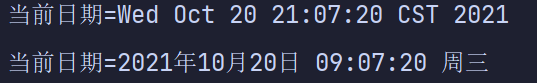
  
- 字符串转日期

  ```java
  String s = "1996年01月01日 10:20:30 星期一";
  Date parse = sdf.parse(s);
  System.out.println("parse=" + sdf.format(parse));//指定格式输出
  ```

#### 2. 第二代日期类

- 第二代日期类，主要就是 Calendar类(日历)

  ```java
  public abstract class Calendar implements Serializable, Cloneable, Comparable<Calendar> {}
  ```

- Calendar类是一个抽象类，它为特定瞬间与一组诸如`YEAR、 MONTH、DATE_OF_MONTH、HOUR`等之间的转换提供了一些方法，并为操作日历字段(例如获得下星期的日期)提供了一些方法。

  ```java
  Calendar c = Calendar.getInstance();//获取抽象类的对象实例，构造器被private
  System.out.println(c.getTime());//Wed Oct 20 21:32:55 CST 2021
  System.out.println(c.get(Calendar.YEAR)+"年");
  System.out.println(c.get(Calendar.MONTH)+"月");
  System.out.println((c.get(Calendar.DAY_OF_MONTH)+1)+"日");//月份要加1
  System.out.println(c.get(Calendar.HOUR_OF_DAY)+"时");
  System.out.println(c.get(Calendar.MINUTE)+"分");
  System.out.println(c.get(Calendar.SECOND)+"秒");
  ```

  - 输出结果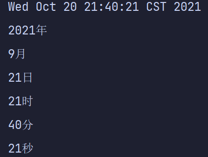
  - Calendar.HOUR_OF_DAY: 24小时进制
  - Calendar.HOUR：12小时进制

- Calendar没有转换格式的类。需要自己定义：

  ```java
  String s = c.get(Calendar.YEAR)+"年"+c.get(Calendar.MONTH)+"月"+	(c.get(Calendar.DAY_OF_MONTH)+1)+"日 "+      c.get(Calendar.HOUR_OF_DAY)+":"+c.get(Calendar.MINUTE)+":"+c.get(Calendar.SECOND);
  System.out.println(s);
  ```

  - 输出结果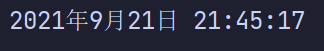

#### 3. 第三代日期类

- 前面两代日期类的不足分析

  JDK 1.0中包含了一个 java.util.Date类，但是它的大多数方法已经在JDK 1.1引入Calendar类之后被弃用了。而 Calendar也存在问题是:

  1)可变性：像日期和时间这样的类应该是不可变的。

  2)偏移性：Date中的年份是从1900开始的，而月份都从O开始。

  3)格式化：格式化只对Date有用， Calendar则不行

  4)此外，它们也==不是线程安全的==；不能处理闰秒等(每隔2天，多出1s)。

- 第三代日期类常用方法

  LocalDate(日期)、 LocalTime(时间)、 LocalDateTime(日期时间) ，JDK8加入

  1. LocalDate只包含日期：年/月/日

  2. LocalTime只包含时间：时:分:秒

  3. LocalDateTime包含日期和时间：年/月/日  时:分:秒

     ```java
     LocalDateTime ldt = LocalDateTime.now();//返回当前的时间
     System.out.println(ldt);//2021-10-20T22:00:07.057186700
     System.out.print(ldt.getYear()+"年");
     System.out.print(ldt.getMonthValue()+"月");
     System.out.print(ldt.getDayOfMonth()+"日--");
     System.out.print(ldt.getHour()+":");
     System.out.print(ldt.getMinute()+":");
     System.out.println(ldt.getSecond());
     ```

     - 输出结果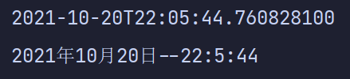

  - 格式化日期类DateTimeFormatter

    ```java
    //格式化日期
    DateTimeFormatter dtf = DateTimeFormatter.ofPattern("yyyy年MM月dd日 hh:mm:ss E");
    System.out.println(dtf.format(ldt));
    ```

  - instant时间戳

    类似于Date：提供了一系列和Date类转换的方式

    - Instant--> Date:
      `Date date = Date.from(instant);`

    - Date-->Instant:
      `Instant instant = date.tolnstant();`

    - 案例演示:

      ```java
      Instant now = Instant.now();
      System.out.println(now);
      Date date = Date.from(now);
      Instant instant  = date.toInstant();
      ```

  - plus方法：获得**当前日期加上多少天(年/月)后**的日期，minus方法与plus相反，是**减**。

    ```java
    System.out.println(dtf.format(ldt));
    //当前日期：2021年10月20日 10:53:58 周三
    System.out.println(dtf.format(ldt.plusDays(30)));
    //30天后的日期：2021年11月19日 10:53:58 周五
    System.out.println(dtf.format(ldt.minusDays(30)));
    //30天前的日期：2021年09月20日 10:53:58 周一
    ```

    

---

### 063 String翻转

- 将字符串中指定部分进行反转比如将"abcdef"反转为" aedcbf"
- String类中有一个方法`toCharArray()`可以将字符串转换成字符数组
   * 编写方法 public static String reverse( String str, int start, int end)搞定

```java
public static String reverse(String str, int start, int end) {
    //将字符串转换为字符数组
    char[] chs = str.toCharArray();
    char temp = ' ';
    for (int i = start, j = end; i < j; i++, j--) {
        temp = chs[i];
        chs[i] = chs[j];
        chs[j] = temp;
    }
    return new String(chs);
}
```

---

## Day-13 集合

Collection

Map

Collections

**集合的引出**

- 前面我们保存多个数据使用的是数组，那么数组有不足的地方，我们分析一下

- 数组

  1)长度开始时必须指定，而且一旦指定，不能更改

  2)保存的必须为同一类型的元素

  3)使用数组进行增加元素的示意代码---比较麻烦

  - 写出 Person数组扩容示意代码。

    ```java
    Person[] pers= new Person[1];
    per[0]=new Person();
    ```

    //增加新的 Person对象?

### 0064 集合框架体系

- 集合
  - 可以==动态保存==任意多个对象，使用比较方便!
  - 提供了一系列方便的操作对象的方法：add、 remove、set、get等;
  - 使用集合添加、删除新元素的示意代码--简洁明了。

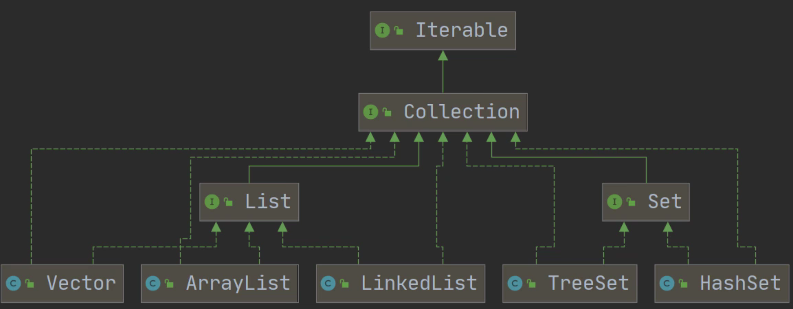

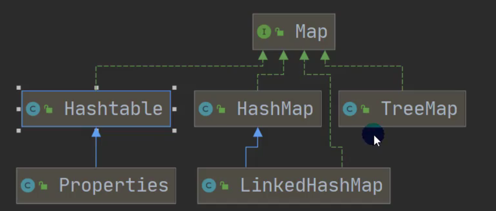

- 集合主要分为两类
  - Collection: 单列集合
  - Map：双列集合

### 0065 Collection接口

- Collection接口==实现类==的特点

  ```java
  public interface Collection <E> extends Iterable<E>
  ```

  1. Collection实现子类可以放多个元素，每个元素可以是 Object
  2. 有些 Collection的实现类，可以存放重复的元素，有些不可以
  3. 有些 Collection的实现类，有些是有序的(List)，有些不是有序(Set)
  4. Collection接口没有直接的实现子类，是通过它的子接口Set和List来实现的

#### 1. Collection接口和常用方法

Collection接口常用方法，用实现子类ArrayList来演示。[CollectionMethod.java](https://gitee.com/song-zhangyao/study/blob/master/Java%20Learning/JavaCode/src/Day_13/collection/CollectionMethod.java)

1. add(): 添加单个元素
2. remove(): 删除指定元素
3. contains()：查找元素是否存在
4. szie()：获取元素个数
5. isEmpty()：判断是否为空
6. clear()：清空
7. addAll()：添加多个元素
8. containsAll()：查找多个元素是否都存在
9. removeAll()：删除多个元素

#### 2. 遍历元素方式1--Iterator(迭代器)

基本介绍

1. Iterator称为迭代器，主要用于 遍历Collection集合中的元素。
2. 所有实现了 Collection接口的集合类都有一个 iterator()方法，用以返回每个实现了 Iterator接口的对象，即可以返回一个迭代器。
3. Iterator的结构图]
4. Iterator仅用于遍历集合， Iterator本身并不存放对象。

**迭代器执行的原理**Iterator.java

`Iterator iterator = col.iterator();`//得到一个集合的迭代器

// `hasNext():`  判断是否还有下一个元素

```java
while(iterator.hasNext()){
	//next():  ①指针下移②将下移以后集合位置上的元素返回
	System.out.println(iterator.next());
}
//3.当退出 whiLe循环后,这时 iterator迭代器,指向最后的元素
//iterator.next()://NoSuchELementException
//4。如果希望再次遍历,需要重置我们的迭代器
iterator = col.iterator();
System.out.println("第二次遍历。要重置迭代器");
while (iterator.hasNext()) {
    Object next =  iterator.next();
    System.out.println(next);
}
```

> 提示：在调用 `itertor.next()`方法之前必须要调用 `.hasNext()`进行检测。
>
> 若不调用，且下一条记录无效，直接调用 `iterator.next()`会抛出`NoSuchElementException`异常。

- 执行上面这个while循环的快捷键 **输入itit，加tab键**

- `Ctrl+j`：显示所有的快捷操作

#### 3. Collection接口遍历对象方式2-for循环增强.

增强for循环，可以代替 iterator迭代器。特点：增强for就是**简化版的 iterator**(底层一样)，本质一样。只能用于遍历==集合或数组==。

- 基本语法

  ```java
  for(元素类型 元素名:集合名或数组名){
  	访问元素
  }
  ```

- 案例演示(看老师演示遍历Book，并使用 Debug源码来证明）[CollectionFor.java](https://gitee.com/song-zhangyao/study/blob/master/Java%20Learning/JavaCode/src/Day_13/collection/CollectionFor.java)

  ```java
  //1.使用增强for循环遍历集合
  for (Object book : col) {
      System.out.println(book);
  }
  ```

  - 快捷键：输入一个I，再tab键

---

### 0065.1 List接口

- 注意：List接口继承了Collection接口

**List接口基本介绍**

- List接口是 Collection接口的子接口 List java

  1) List集合类中元素有序(即添加顺序和取出顺序一致)、且可重复

  2) List集合中的每个元素都有其对应的顺序索引，即支持==索引==。

  3) List容器中的元素都对应一个整数型的序号记载其在容器中的位置，可以根据序号存取容器中的元素。

  4) List接口中==常用==的实现子类

     ArrayList、LinkedList、 Vector、Stack

- List接口常用方法[ListMethod.java](https://gitee.com/song-zhangyao/study/blob/master/Java%20Learning/JavaCode/src/Day_13/list/ListMethod.java)

  List集合里添加了一些根据引来操作集台元素的方法
  1) void add( int index, Object ele)：在 index位置插入ele元素
  2) boolean addAll(int index, Collection eles)：从 index位置开始将eles中的所有元素添加进来
  3) Object get(int index)：获取指定 index位置的元素
  4) int indexOf(Object obj)：返回obj在集合中首次出现的位置
  5) int lastIndexOf(Object obj)：返回obj在当前集合中末次出现的位置
  6) Object remove( int index)：移除指定 index位置的元素，并返回此元素
  7) Object set( int index, Object ele)：设置指定 index位置的元素为ele，相当于是==替换==.
  8) List subList( int fromIndex, int tolndex)：返回从 fromIndex到tolndex位置的子集合

- List的三种遍历方式[ ArrayList, Linkedlist, Vector]
  ListFor.java

  1) 方式一：使用 Iiterator

     ```java
     Iterator it = list.iterator;
     while(it.hasNext()){
     	Object obj = it.next();
         System.out.println(obj);
     }
     ```

  2. 方式二:使用增强for

     ```java
     for (Object o : list) {
         System.out.println(o);
     }
     ```

  3) 方式三：使用普通for

     ```java
     for (int i = 0; i < list.size(); i++) {
         System.out.println(list.get(i));
     }
     ```

- List接口实现子类的冒泡排序

  ```java
  //按照价格从低到高进行排序
  public static void sortPrice(List list) {
      for (int i = 0; i < list.size() - 1; i++) {
          for (int j = 0; j < list.size() - 1 - i; j++) {
              //取出对象
              Book book1 = (Book) list.get(j);//向下转型
              Book book2 = (Book) list.get(j + 1);//向下转型
              if (book1.price > book2.price) {
                  list.set(j, book2);
                  list.set(j + 1, book1);
              }
          }
      }
  }
  ```

  ----

### 0065.1.1 ArrayList类

> ArrayList实现了List接口和Collection接口

- **ArrayList的注意事项**
  	[ArrayListDetail.java](https://gitee.com/song-zhangyao/study/blob/master/Java%20Learning/JavaCode/src/Day_13/list/ArrayListDetail.java)

  1. permits all elements， including null， ArrayList可以加入null，并且多个
  2. ArrayList是由**数组**来实现数据存储的
  3. ArrayList基本等同于 Vector，除了 ArrayList是==线程不安全(执行效率高)==看源码
     在多线程情况下，不建议使用 ArrayList。

- ArrayList扩容机制

- ArrayList的底层操作机制源码分析(重点，难点）
  ArrayListSource.java

  1) ArrayList中维护了一个 Object类型的数组 elementData.[ debug看源码】
  `transient Object[] elementData;`

  transient：表示瞬间短暂的,表示该属性不会被序列化

  2) 当创建 ArrayList对象时，如果使用的是**无参构造器**，则初始 elementData容量为0，第1次添加，则扩容 elementData为10；如需要再次扩容，则扩容 elementData为1.5倍。

  3) 如果使用的是**指定大小的构造器**，则初始 elementData容量为指定大小，如果需要扩容，则直接扩容 elementData为1.5倍。

### 0065.1.2 Vector类

> 实现了List接口和Collection接口

- Vector底层也是一个对象数a， protected Object[] elementData;

- Vector是线程同步的，即==线程安全==， Vector类的操作方法带有 synchronized关键字

  ```java
  public synchronized E get(int index){
      if (index > element Count) 
          throw new ArraylndexOutofBounds Exception (index);
      return elementData ( index);
  }
  ```

  

- 在开发中，需要==线程同步安全==时，考虑使用 Vector

**Vector与ArrayList的比较**

|           |     底层结构     |  版本  | 线程安全、效率 |                           扩容倍数                           |
| :-------: | :--------------: | :----: | :------------: | :----------------------------------------------------------: |
| ArrayList |     可变数组     | jdk1.2 | 不安全、效率高 | 如果有参构造1.5 如果是无参          1. 第一次10         2. 从第二次开始按照1.5倍扩 |
|  Vector   | 可变数组Object[] | jdk1.0 |  安全、效率低  | 如果是无参，默认10。满后，就按2倍扩容。如果指定大小，则每次直接按2倍扩 |

---

### 0065.1.3 LinkedList类

> 实现了List接口和Collection接口

**基本介绍**

1. LinkedList实现了==双向链表==和==双端队列==特点
2. 可以添加任意元素(元素可以重复)，包括null
3. 线程**不安全**，没有实现同步。

**底层结构**

1. Linkedlist底层维护了一个==双向链表==
2. Linkedlist中维护了两个属性 `first`和`last`分别指向首节点和尾节点
3. 每个节点(Node对象)，里面又维护了`prev`、`next`、`item`三个属性，其中通过prev指向前一个，通过next指向后一个节点。最终实现双向链表。
4. 所以 Linkedlist的元素的==添加和删除==，**不是通过数组完成的**，相对来说**效率较高**。
5. 模拟一个简单的双向链表【走代码】 [LinkedList_.java](https://gitee.com/song-zhangyao/study/blob/master/Java%20Learning/JavaCode/src/Day_13/list/LinkedList_.java)

**LinkedList的增删改查(CRUD)**：[LinkedListCRUD.java](https://gitee.com/song-zhangyao/study/blob/master/Java%20Learning/JavaCode/src/Day_13/list/LinkedListCRUD.java)

```java
LinkedList linkedList = new LinkedList();
//1. 增加
linkedList.add(1);
linkedList.add(2);
linkedList.add(3);
LinkedList linkedList1 = new LinkedList();
linkedList1.add(1);
linkedList1.add(2);
linkedList1.add(3);
System.out.println(linkedList);//1,2,3
//2. 删除:默认删除第一个
linkedList.remove();
System.out.println(linkedList);//2,3
//指定索引删除
linkedList.remove(0);
System.out.println(linkedList);//3
//3. 修改
linkedList1.set(0,9);//索引0，替换为9
System.out.println(linkedList1);//9,2,3
//4. 查
System.out.println(linkedList1.contains(9));//true
System.out.println(linkedList1.contains(5));//false
//5. 根据获取对象
System.out.println(linkedList1.get(1));//2
```

- 遍历也可以用List接口的方法

**ArrayList和LinkedList的比较**

|            | 底层结构 |      增删效率      | 改查的效率 |
| :--------: | :------: | :----------------: | :--------: |
| ArrayList  | 可变数组 |   较低、数组扩容   |    较高    |
| LinkedList | 双向链表 | 较高、通过链表追加 |    较低    |

- 如何选择 Array Listi和 LinkedList:
  1) 如果我们改查的操作多，选择 ArrayList
  2) 如果我们增删的操作多，选择 LinkedList
  3) 般来说，在程序中，80%-90%都是==查询==，因此大部分情况下会选择 ArrayList
  4) 在一个项目中，根据业务灵活选择，也可能这样，一个模块使用的是 ArrayList；另外一个模块是Linkedlist，也就是说，**要根据业务来进行选择**。

### 0065.2 Set接口

> Set接口继承了Collection接口

**基本介绍**

- 无序(添加和取出的顺序不一致)，==没有索引==[后面演示]

- 不允许重复元素，所以最多包含一个null；

- JDK API中Set接口的实现类有

  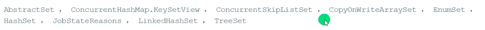
  - 常用的：

**Set接口常用方法**

- 和List接口一样，Set接口也是 Collection的子接口；因此，常用方法和Collection接口一样。

**set接口的遍历方式**

- 同 Collection的遍历方式一样，因为Set接口是 Collection接口的子接口。

  1. 可以使用迭代器
  2. 增强for
  3. **不能使用索引**的方式来获取：没有get方法

  ```java
  //遍历方式：两种
  //遍历1: 迭代器
  Iterator it = set.iterator();
  while (it.hasNext()) {
      Object next = it.next();
      System.out.print(next + " ");
  }
  System.out.println();
  
  //遍历2：增强for
  for (Object o : set) {
      System.out.print(o + " ");
  }
  //不能通过索引获取
  ```

  ---

### 0065.2.1 HashSet类

> 实现了Set和Collection接口

- HashSet的全面说明HashSet_.java

  1. HashSet实现了Set接口

  2. HashSet实际上是 HashMap，看下源码.(图)

     ```java
     public HashSet(){
     	map = new HashMap<>();
     }
     ```

  3. 可以存放null值，但是只能有一个null

  4. HashSet不保证元素是**有序**的，取决hash后，再确定索引的结果

  5. 不能有重复元素/对象，在前面Set接口使用已经讲过。

- HashSet底层机制说明

  - 分析 HashSet底层是 HashMap，HashMap底层是(==数组+链表+红黑树==)
  - [HashSetStructure.java](https://gitee.com/song-zhangyao/study/blob/master/Java%20Learning/JavaCode/src/Day_13/set/HashSetStructure.java)为了让大家真正理解，老韩模拟简单的数组+链表结构。

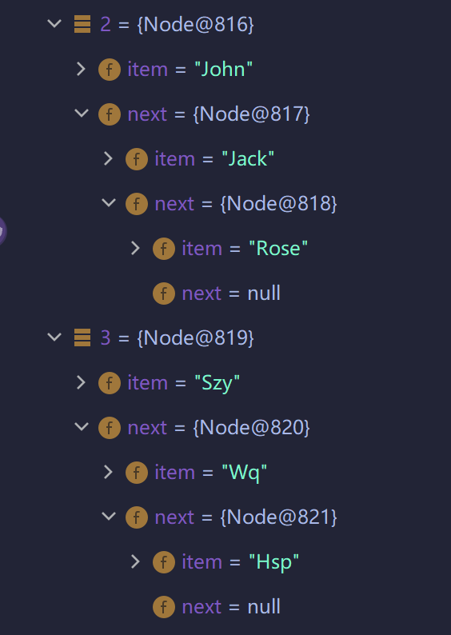

- HashSet底层是 HashMap	
  1. 添加一个元素时，先得到hash值--会转成->索引值
  2. 找到存储数据表 table，看这个索引位置是否已经存放的有元素；
  3. 如果没有，直接加入；
  4. 如果有，调用equals比较，如果相同，就**放弃添加**。
  5. 如果不相同，则添加到最后。
  6. 在Java 8中，如果一条链表的元素个数到达 TREEIFY_THRESHOLD(默认是8)，并且 table的大小  >
     MIN_TREEIFY CAPACITY（默认64），就会进行树化(红黑树)。

- 分析HashSet的==扩容==和==转成红黑树==HashSetIncrement.java
  1. HashSet底层是 HashMap，第一次添加时， 
     - table数组扩容到16，
     - 临界值threshold是16，
     - 加载因子( loadFactor)是0.75*16=12
  2. 如果 table数组使用到了临界值12，就会扩容到16*2=32，
     - 新的临界值就是2*0.75=24，
     - 依次类推：在Java8中如果一条链表的元素个数到达 TREEIFY_THRESHOLD(默认是8)
     - 并且tabe的大小>=MIN_TREEIFY_CAPACITY(默认64)就会进行树化(红黑树)，
     - 否则仍然采用数组扩容机制

### 0065.2.2 LinkedHashSet类

0530


----

### 0066 Map接口


#### **1. Map接口实现类的特点[很实用]**

注意:这里讲的是JDK8的Map接口特点 Map_.java--用实现子类HashMap来演示
1. **Map与 Collection并列存在**。用于保存具有映射关系的数据:`Key-Value`(双列元素)
2. Map中的key和value可以是任何引用类型的数据，会封装到 `HashMap$Node`对象中
3. Map中的key不允许重复，==原因和 HashSet一样，前面分析过源码==

4. Map中的value可以重复

5. Map的key可以为 null，value也可以为null，注意key为null只能有一个，value为null，可以多个

6. 常用 String类作为Map的key

7. key和 value之间存在==单向一对一关系==，即通过指定的key总能找到对应的value

   ```java
   Map map = new HashMap();
   //占坑位只和Key有关，和value无关
   map.put("no1","张无忌");//K-V
   map.put("no2","尹志平");//K-V
   //{no2=尹志平, no1=张无忌}
   map.put("no1","张三丰");//当有相同的Key时，就等价于替换先前Key中的Value；即table中的张无忌会被替换成张三丰
   //{no2=尹志平, no1=张三丰}
   map.put("no3","尹志平");//只要Key不同，相同的value值可以加入
   //{no2=尹志平, no1=张三丰, no3=尹志平}
   map.put(1,"hhh");
   //{no2=尹志平, no1=张三丰, 1=hhh, no3=尹志平}
   System.out.println(map);
   System.out.println(map.get("no2"));//尹志平
   ```

8) Map存放数据的key-value示意图，一对k-v是放在一个 HashMap$Node中的，又因为Node实现了 Entry接口，<有些书上也说一对k-v就是一个 Entry(如图)>[代码演示]

   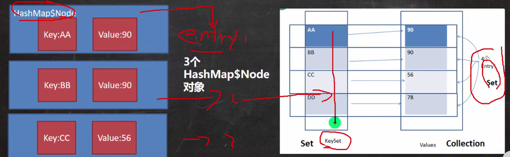

#### 2. Map接口常用方法

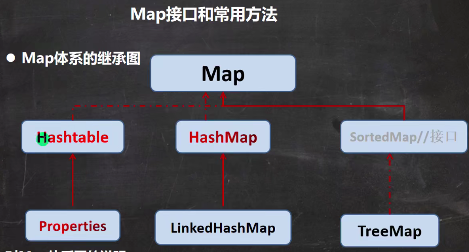

**常用方法**MapMethod.java

1. put：添加
2. remove：根据键(Key)删除映射关系
3. get：根据键获取值
4. size：获取元素个数
5. isEmpty：判断个数是否为空
6. clear：清除
7. containsKey：查找键是否存在

#### 3. Map遍历<6种>

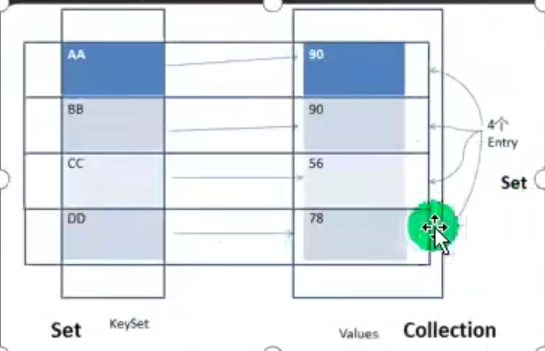

MapFor.java
1) containsKey：查找键是否存在
2) keySet：获取所有的键
3) entrySet：获取所有关系
4) values：获取所有的值

- 如下第一种最常用：

```java
//第一组:先取出所有的Key,通过Key取出对应的 Value
Set keyset = map.keySet();
//1).增强for
for (Object key : keyset) {
    System.out.println(key + "-" + map.get(key));
}
System.out.println("=====");
//2).迭代器
Iterator it = keyset.iterator();
while (it.hasNext()) {
    Object key = it.next();
    System.out.println(key + "-" + map.get(key));
}
//第二组：values：获取所有的值
Collection values = map.values();
//可以用Collection的所有遍历方法
System.out.println("===");
//1).迭代器
Iterator it1 = values.iterator();
while (it1.hasNext()) {
    Object value = it1.next();
    System.out.println(value);
}
//2).增强for
System.out.println("===");
for (Object o : values) {
    System.out.println(o);
}

//第三组：entrySet：获取所有关系
Set entrySet = map.entrySet();
//1)
for (Object o : entrySet) {
    Map.Entry e = (Map.Entry) o;
    System.out.println(e.getKey()+"-"+e.getValue());
}
```

- 练习
  1. MapExercise01.java

### 0066.1 HashMap

> HahMap是Map接囗实现类

**基本介绍**

1) Map接口的常用实现类: HashMap、 Hashtable和 Properties.
2) HashMap是Map接口==使用频率最高==的实现类。
3) HashMap是以key-val对的方式来存储数据（`HashMap$Node`类型）[案例 Entry]
4) key不能重复，但是是值可以重复允许使用null键和null值
5) 如果添加相同的key，则会覆盖原来的key-val，等同于==修改==(key不会替换，val会替换)
6) 与 HashSet一样，不保证映射的顺序，因为底层是以hash表的方式来存储的【HashMap底层：数组+链表+红黑树】
7) HashMap没有实现同步，因此是==线程不安全的==。没有`synchronized`关键字

#### 1. HashMap底层机制及源码解析

- 一个示意图

  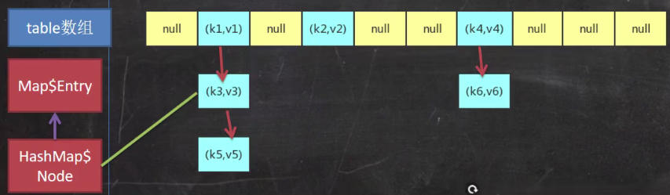
  1. (k，v)是一个Node实现了MapEntry<K>，查看 HashMap的源码可以看到
  2. jdk7.0的 HashMap底层实现[数组+链表]，jdk8.0底层[擞数组+链表+红黑树]

- 扩容机制HashMapSource.java

  1) HashMap底层维护了Node类型的数组 table，默认为null
  2) 当创建对象时，将加载因子(`loadfactor`)初始化为0.75
  3) 当添加key-val时，通过**key的哈希值**得到在table的索引。然后判断该索引处是否有元素
     - 如果没有元素直接添加。
     - 如果该索引处有元素，继续判断该元素的key是否和准备加入的key相等，
       - 如果相等，则直接替换val
       - 如果不相等，需要判断是树结构还是链表结构，做上相应处理。
     - 如果添加时发现容量不够，则需要扩容。

  4) 第1次添加，则需要扩容 table容量为16，临界值 `threshold`)为[16*0.75=12]
  5) 以后再扩容，则需要扩容 table容量为原来的2倍，临界值为原来的2倍即24。依次类推
  6) 在Java8中如果一条链表的元素个数超过 `TREEIFY_THRESHOLD`(默认是8)，并且`table的大小>= MIN_TREEIFY_CAPACITY`(默认64)，就会进行树化(红黑树).【两个条件】

### 0066.2 Hashtable

● Hashtable的基本介绍

- Hashtable是Map接口的实现子类

1) 存放的元素是键值对:即K-V

2) hashtable的键和值都不能为null，否则会抛出NullPointerException
3) hashtable使用方法基本上和 HashMap一样
4) hashtable是**线程安全**的, hashMap是线程不安全的
5) 简单看下底层结构

> try-catch快捷键：Ctrl+ALT+T

### 0066.2.1 Properties类

基本介绍

1. Properties类继承自 Hashtable类并且实现了Map接口，也是使用一种键值对的形式来保存数据。
2. 它的使用特点和 Hashtable类似
3. Properties还可以用于从 XXX.properties文件中，加载数据到 Properties类对象；并进行读取和修改
4. 说明:工作后 XXX.properties文件通常作为配置文件，这个知识点在IO流举例。有兴趣可先看文章

### 总结开发中如何选择集合实现类🎈😘

在开发中，选择什么集合实现类，主要取决于==业务操作特点==，然后根据集合实现类特性进行选择，分析如下

- 先判断存储的类型(一组对象或一组键值对)
  1. 一组对象【单列】: Collection接口
     - 允许重复:List
       1. 增删多: Linkedlist[底层维护了一个双向链表]
       2. 改查多: ArrayList底层维护 Object类型的可变数组
     - 不允许重复:Set
       1. 无序: HashSet[底层是 HashMap，维护了一个哈希表即(数组+链表+红黑树)
       2. 排序: TreeSet
       3. 插入和取出顺序一致: LinkedHashSet，维护 数组+双向链表
  2. 一组键值对【双列】: Map接口
     - 键无序: HashMap[底层是:哈希表jdk7:数组+链表，jdk8:数组+链表+红黑树]
     - 键排序: TreeMap
     - 键插入和取出顺序一致: LinkedHashMap
     - 读取文件 Properties

### 0067 TreeSet和TreeMap

#### TreeSet

> 实现了Set接口，不同的是，它可以排序；"TreeSet底层就是TreeMap"

- 代码

  ```java
  TreeSet treeSet = new TreeSet(new Comparator() {
              @Override
              public int compare(Object o1, Object o2) {
                  return ((String)o1).compareTo((String)o2);
                  /*
                     改变o1和o2的位置，可以改变它的排序方式
                        o1在前，或者没有这个匿名内部类。就是按首字母的ASCII值升序;A->Z->a->z
                        o2在前，就是降序。z->a->Z->A
                   */
              }
          });
  treeSet.add("d");
  treeSet.add("a");
  treeSet.add("cd");
  treeSet.add("b");
  System.out.println(treeSet);//默认按首字母升序排列：[a, b, c, d]
  ```

- TreeSet的顺序

  1. 默认是按首字母`ASCII`值升序：A->Z->a->z

  2. 对于代码种的匿名内部类

     ```java
     TreeSet treeSet = new TreeSet(new Comparator() {
                 public int compare(Object o1, Object o2) {
                     return ((String)o1).compareTo((String)o2);
                 }
             });
     ```

     -   改变o1和o2的位置，可以改变它的排序方式

       1. o1在前，或者没有这个匿名内部类。就是按首字母的ASCII值升序;A->Z->a->z
       2. o2在前，就是降序。z->a->Z->A

     - 按照长度大小排序: 改变匿名内部类的返回语句

       ```java
       return ((String)o2).length ()-((String)o1).length();
       ```

       

  TreeMap和TreeSet类似

### 0068 Collections工具类

**Colllections工具类介绍**

1) Collections是一个操作Set、List和Map等集合的工具类
2) Collections中提供了一系列静态的方法对集合元素进行排序、查询和修改等操作，

**排序操作:(均为 static方法)**

1. reverse(List)：反转List中元素的顺序

2. shuffle(List)：对List集合元素进行随机排序

3. sort(List)：根据元素的自然顺序对指定List集合元素按升序排序

4. sort(List,Comparator)：根据指定的 Comparator产生的顺序对List集合元素进行排序

5. swap(List,int,int)：将指定list集合中的i处元素和j处元素进行交换

6. 应用案例演示 Collections_.java

   ```java
   public class Collections_ {
       public static void main(String[] args) {
           List list = new ArrayList();
           list.add(1);
           list.add(2);
           list.add(3);
           list.add(4);
           System.out.println(list);//[1, 2, 3, 4]
           //1) reverse(List)：反转List中元素的顺序
           Collections.reverse(list);
           System.out.println(list);//[4, 3, 2, 1]
           //2) shuffle(List)：对List集合元素进行随机排序
           Collections.shuffle(list);
           System.out.println(list);//[3, 2, 4, 1]
           //3) sort(List)：根据元素的自然顺序对指定List集合元素按升序排序
           Collections.sort(list);
           System.out.println(list);//[1, 2, 3, 4]
           //4) sort(List,Comparator)：根据指定的 Comparator产生的顺序对List集合元素进行排序
   
           list.set(0,"tom");
           list.set(1,"jack");
           list.set(2,"we");
           list.set(3,"jjjjj");
           try {
               Collections.sort(list, new Comparator<Object>() {
                   @Override
                   public int compare(Object o1, Object o2) {
                       return ((String)o1).length()-((String)o2).length();
                       //根据字符串长度排序
                   }
               });
               System.out.println(list);//[we, tom, jack, jjjjj]
           } catch (Exception e) {
               System.out.println(e.getMessage());
           }
           //5) swap(List,int,int)：将指定list集合中的i处元素和j处元素进行交换
           Collections.swap(list,1,3);
           System.out.println(list);//[we, jjjjj, jack, tom]
       }
   }
   ```

7) max(): 按照自然排序得到的最大值(最大ASCII值)

8) max(List,Comparator)：得到指定的 Comparator产生的元素

9) frequency(List,ele)：指定元素ele的出现次数

10) copy(List dest,List src): 拷贝

11) replaceAll(List List, Object oldVal,Object newVal)：使用新值替换List对象的所有旧值

----

- 试分析HashSet和TreeSet分别如何实现去重的
  - HashSet的去重机制：hashCodeO+equalsO，底层先通过存入对象，进行运算得到一个hash值，通过hash值得到对应的索引，如果发现table索引所在的位置，没有数据，就直接存放；如果有数据，就进行equals比较遍历比较，如果比较后，不相同，就加入，否则就不加入，
  - TreeSet的去重机制：如果你传入了一个Comparator名对象，就使用实现的compare去重，如果方法返回0.就认为是相同的元素/数据，就不添加，如果你没有传入一个Comparator匿名对象，则以你添加的对象实现的Compareable接口的compareTo去重。

- ArrayList和Vector的比较

  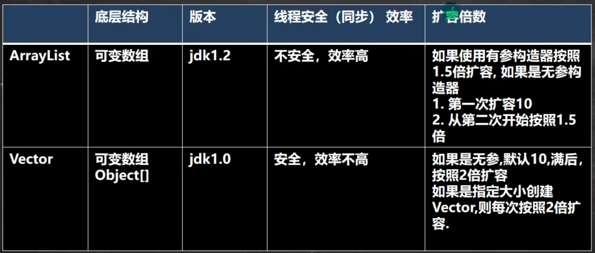

  
