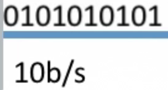

# 第一章 计算机网络概述

### 1.1.1 概念、组成、功能和分类

- 思维导图

   

- 计算机网络的分类

  -  按分布范围分
     -  广域网(WAN)

----

### 1.1.3 计算机性能指标

**速率**

- 速率：又叫**数据率**、**数据传输率**、**比特率**

- 比特：1/0位

- 连接在计算机网络上的**主机**在数字信道上传输数据**位数的速率**

- 单位：b/s，kb/s，Mb/s，Gb/s，Tb/s

   

  - <!--01010 10101是10位数据，在一秒内传输完毕，所以速率就是10b/s.-->

**单位换算**

- 形容**速率**
  - 千：1kb/s = 10^3^b/s
  - 兆：1Mb/s = 10^3^kb/s = 10^6^b/s
  - 吉：1Gb/s = 10^3^Mb/s = 10^6^kb/s = 10^9^b/s
  - 太：1Tb/s = 10^3^Gb/s = 10^6^Mb/s = 10^9^kb/s = 10^12^b/s
- 时间
  - 1ms(毫秒)= 10^3^us(微秒)
  - 1s = 10^3^ms=10^6^us
- 形容**存储容量**
  - 存储容量1Byte(字节)=8bit(比特)
  - 1KB=2^10^B=1024B=10*8b
  - 1MB=2^10^KB=1024KB
  - 1GB=2^10^MB=1024MB
  - 1TB=2^10^GB=1024GB

**带宽**

- “带宽”原本指某个信号具有的频带宽度，即最高频率与最低频率之差，单位是赫兹(Hz)。

- 计算机网络中，带宽用来表示网络的通信线路**传送数据的能力**，通常是指单位时间内从网络中的某一点到另一点所能通过的“**最高数据率**”。单位是“比特每秒”，b/s、kb/s、Mb/s、Gb/s。

  ==网络设备所支持的最高速度==

- 示例：
  1.   
  2.   

**吞吐量**

- 表示在**单位时间**内通过**某个网络**(或信道、接口)的数据量。单位b/s，kb/s，Mb/s等。

- 吞吐量受网络的带宽或网络的额定速率的限制。

  

----

### 1.1.4 时延、时延带宽积、RTT和利用率

**时延**

- 指数据(报文/分组/比特流)从网络(或链路)的一端传送到另一端**所需的时间**。也叫延迟或迟延。单位是`s`。
1. **发送时延**
   - $\boxed{发送时延=\frac {数据长度(bit)}{信道带宽[发送速率](bit/s)}}$,  发送时延就是10b/s
1. **传播时延**：取决于电磁波传播速度和链路长度
   - $\boxed{传播时延=\frac {信道长度(m)}{电磁波在信道上的传播速率(m/s)}}$，==电磁波传播速率一般是2×10^8^m/s==
3. 排队时延：等待输出/输入链路可用
4. 处理时延：检错、找出口

> 注意：**高速链路**指的是降低了发送时延，即提高了发送速率

**时延带宽积**

- $\boxed{时延带宽积(bit) = 传播时延(s) × 带宽(bit/s)}$
- 时延带宽积又称为**以比特为单位的链路长度**。
  - 即“某段链路现在有多少比特”
  - 容量

**往返时延RTT**

- 从发送方发送数据开始，到**发送方**收到**接收方**的**确认**<!--接收方收到数据后立即发送确认-->，总共经历的时延。
- RTT越大，在收到确定前，可以发送的数据越多
- $\boxed{RTT包括\begin{cases}  往返传播时延=传播时延*2\\ 末端处理时间\end{cases}}$

**利用率**

- 分类

  - 信道利用率
  - 网络利用率

- 信道利用率✨=$\boxed{\frac {有数据通过时间}{(有+无)数据通过时间}}$

- 网络利用率：信道利用率加权平均值

  

----

### 1.2.1 分成结构、协议、接口、服务

- 为什么要分成？

  **发送文件前要完成的工作**

  1. 发起通信的计算机必须将数据通信的通路进行**激活**。
  2. 要告诉网络如何**识别目的主机**
  3. 发起通信的计算机要查明目的主机**是否开机**，并且与**网络连接正常**。
  4. 发起通信的计算机要弄清楚，对方计算机中文件管理程序是否已经做好**准备**工作。
  5. 确保**差错和意外**可以解决。

- 分层的基本原则

  1. 各层之间相互**独立**，每层只实现一种相对独立的功能。
  2. 每层之间**界面自然清晰**，易于理解，相互交流尽可能少
  3. 结构上可分割开。每层都采用**最合适的技术**来实现。
  4. 保持**下层**对**上层**的独立性，==上层单向使用下层提供的服务==。
  5. 整个分层结构应该能促进标准化工作

----

**分层结构**✨

- 结构图

  

----

- 对结构图的概念解析

  1. **实体**：第n层中的活动元素称为**n层实体**。同一层的实体叫**对等实体**。

  2. **协议**：为进行网络中的**对等实体**数据交换而建立的规则、标准或约定称为网络协议。【水平】

     $\begin{cases}  语法：规定传输薮据的格式\\ 语义：规定所要完成的功能\\同步：规定各种操作的顺序\end{cases}$

  3. **接口(访问服务点SAP)**：上层使用下层服务的入口。

  4. **服务**：下层为相邻上层提供的功能调用。【垂直】

  5. **SDU、PCI、PDU**

     - **SDU**服务数据单元：为完成用户所要求的功能而应传送的数据。
     - **PCI**协议控制信息：控制**协议操作**的信息。
     - **PDU**协议数据单元：**对等层次**之间传送的数据单位。

**概念总结**

1. 网络体系结构是从**功能**上描述计算机网络结构。
2. 计算机网络体系结构简称网络体系结构是**分层结构**。
3. 每层遵循某个/些**网络协议**以完成本层功能。
4. 计算机网络体系结构是计算机网络的**各层及其协议的集合**
5. 第n层在向n+1层提供服务时，此服务不仅包含第n层本身的功能，还包含由下层服务提供的功能。
6. 仅仅在**相邻层间有接口**，且所提供服务的具体实现细节对上一层完全屏蔽。
7. 体系结构是**抽象**的，而实现是指能运行的一些软件和硬件。

----

### 1.2.2 OSI参考模型(1)

**OSI参考模型(第一话)**

- ISO/OSI参考模型怎么来的？
  - 为了解决计算机网络复杂的问题→分层结构(按==功能==)
    - IBM公司提出了第一个网络体系结构(SNA)
    - 然后是DEC公司提出(DNA)，美国国防部提出的TCP/IP(事实标准)...等很多公司
  - 目的：支持**异构网络系统**的互联互通
  - 国际标准化组织(ISO)于1984年提出开放系统互连(OSI)参考模型。但是!理论成功，市场失败。

**OSI七层**

- 层级图--每一层都对应一定的功能

  

- 上四层[7~4]是端到端的，下三层是点对点的

-----

### 1.2.3 OSI参考模型(2)

**应用层**

- 所有能狗和用户产生网络流量的程序
- 典型的应用层服务
  -  文件传输（FTP）
  - 电子邮件（SMTP）
  - 万维网（HTTP）

**表示层**

- 用于处理在两个通信系统中交换信息的表示方式（语法和语义）
- **功能一：数据格式变换（翻译官）**
- **功能二：数据加密解密**
  - 例如："我的微信密码是XXXX"
- **功能三：数据压缩和恢复**

**会话层**

- 向表示层的尸体/用户进程**提供建立**连接并在连接上**有序**地**传输数据**，这是会话，也是**建立同步**(SYN)
- **功能一**：建立、管理、终止会话
- **功能二**：使用校验点可使会话在通信失效时从**校验点/同步点**继续回复通信，实现**数据同步**。
- ==使用于传输大文件==
- 主要协议：ADSP、ASP

**传输层**

- 负责主机中两个进程的通信，即端到端的通信。传输单位是**报文段**或用户**数据报**
- **功能一**：==可==靠传输、不可靠传输
- 功能二：==差==错控制
- 功能三：==流==量控制
- 功能四：复==用==分用
  - 复用：多个应用进程可同时使用下面运输层的服务
  - 分用：运输层把收到的信息分别交付给上面应用层中相应的进程。

**网络层**

- 主要任务：把**分组**从源端传到目的端，为分组交换网上的不同主机提供通信服务。
- 网络层传输单位是**数据报**
- 功能
  - 功能一：路由选择--<**选择最佳路径**>
  - 功能二：流量控制--控制发送端的速度
  - 功能三：差错控制
  - 功能四：拥塞控制
    - 若所有节点都来不及接受分组，而要丢弃大量分组的话，网络就处于==拥塞==状态。因此要采取一定措施，缓解这种拥塞

**数据链路层**

- 主要任务：把网络层传下来的数据==组装成帧==
- 数据链路层的传输单位是**帧**
- 功能：
  - 功能一：成帧（定义帧的开始和结束）……10000011101010101……
  - 功能二：差错控制--**帧错+位错**
  - 功能三：流量控制
  - 功能四：访问（接入）控制--**控制对信道的访问**
- 主要协议：SDLC、HDLC、PPP、STP

**物理层**

- 主要任务：在**物理媒介**上实现比特流的**透明传输**

- 传输单位：==比特==

- **透明传输**：指不管所传数据是什么样的比特组合，都应当能够在链路上传送

  

- 功能：

  - 功能一：定义接口特性
  - 功能二：定义传输模式：**单工、半双工、双工**
  - 功能三：定义传输速率
  - 功能四：比特同步
  - 功能五：比特编码

----

### 1.2.4 TCP、IP参考模型和5层参考模型

 

**OSI参考模型与TCP/IP参考模型相同点**

1. 都分层
2. 基于独立的协议栈的概念
3. ==可以实现异构网络互联==

**不同点**

1. OSI定义三点：服务 、协议、接口

2. OSI先出现，参考模型先于协议发明，不偏向特定协议

3. TCP\IP设计之初就考虑到异构网络**互联**问题，将IP作为重要层次

   |        | ISO/OSI参考模型 |   TCP/IP模型    |
   | :----: | :-------------: | :-------------: |
   | 网络层 | 无连接+面向连接 |     无连接      |
   | 传输层 |    面向连接     | 无连接+面向连接 |

4. **面向连接**分为三个阶段，第一个是建立连接==¹==，在此阶段，发出一个建立连接的请求。只有在连接成功建立之后，才能开始传输数据==²==，这是第二阶段。接着，当数据传输完毕，必须释放连接==³==。

5. 而**无连接**没有这么多阶段，它直接进行数据传输

   

**5层参考模型**

- ==综合了OSI和TCP/IP的优点==

  

- **5层参考模型的数据封装与解封装**--体系图

  

### 1.3 第一章思维导图

> 注意：自己下去将思维导图完善，掌握每一个节点的概念

----2020/10/9

----

# 第四章 网络层

## 4.1 网络层功能

### 4.1.1 网络层功能概述

- 主要任务：把**分组**从源端传到目的端，为分组交换网上不同主机提供通信服务。网络传输单位是**数据报**。
- 注意：数据报和分组在这儿类似于父与子的关系。
- 功能：
  - 功能一：路由选择和分组转发----最佳路径
  - 功能二：异构网络互联
  - 功能三：拥塞控制
    - 若所有结点都来不及接受分组，而要丢弃大量分组的话，网络就处于拥塞状态。因此要采取一定措施
      缓解这种拥塞。

### 4.1.2 数据交换方式

电路交换、报文交换和分组交换

为什么要数据交换？

**1. 电路交换**

- e.g.电话网络

- 电路交换的阶段

  

- **优点：**
  
  1. 通信时延小
  2. 有序传输
  3. 没有冲突
  4. 实时性强
- **缺点:**
  1. ==建立连接==时间长
  2. 线路独占，==使用效率低==
  3. 灵活性差
  4. 无**差错控制**能力

**2. 报文交换**

- 报文：源应用发送的信息整体

- 过程

  

- 优点：
  1. ==无需建立连接==
  2. 存储转发，动态分配路线
  3. 线路可 靠性较高
  4. 线路利用率较高
  5. 多目标服务
- 缺点：
  1. 有存储转发时延
  2. 报文大小不定，需要网络节点有较大缓存空间

**3. 分组交换**✨（效率高）

- 分组 ：把大的数据块(报文)分割成为较小的数据块。

  

- 优点：
  1. ==无需建立连接==
  2. 存储转发，动态分配线路
  3. 线路可靠性较高
  4. 线路利用率较高
  5. **相对于报文交换，存储管理更加容易**。
- 缺点：
  1. 有存储转发时延
  2. 需要传输额外的信息量
  3. 乱序到目的主机时，要对分组排序==重组==

- 计算题中要注意的几点
  1. 单位换算:b/ B, Mbps, kbps
  2. 是否考虑传播延迟
  3. 时间至少是多少一一选择最少跳数
  4. 起始时间(从发送开始到接收完为止/从发送开始到发送完毕)
  5. 是否有分组头部大小的开销
  6. 报文交换时延更长，分组交换时延可能不是整数

**三种数据交换方式的比较**

- 总结：
  1. **报文交换**和**分组交换**都采用了存储转发
  
  2. 传送数据量大，且传送时间远大于呼叫时，选择电路交换。==电路交换传输时延最小==
  
  3. 从信道利用率来看，报文交换和分组交换优于电路交换，其中分组交换时延更小。
  
     ----

### 4.1.3 数据报与虚电路

- **数据报方式**为网络层提供==无连接服务==。
- **虚电路方式**为网络层提供==连接服务==。
- **无连接服务**：不事先为分组的传输确定传输路径，每个分组独立确定传输路径，不同分组传输路径可能不同。
- **连接服务**：首先为分组的传输确定传输路径(==建立连接==)，然后沿该路径(连接)传输系列分组，系列分组传输路径相同，传输结束后拆除连接。

> 虚电路方式就是将电路交换和分组交换融合。

**各层传输单元**

1. 应用层

   - 报文

2. 传输层

   - 报文(段)

3. **网络层**

   - IP数据报-->分组(如果数据报过大，就会进行切割，每一个切割后的块就是**分组**)

4. 数据链路层

   - (加头加尾)-->帧

5. 物理层

   - 比特流

     ----

  **1. 数据报方式**(因特网在用)

- ✨**无连接服务**：不事先为分组的传输确定传输路径，每个分组独立确定传输路径，不同分组传输路径可能不同。

- 每个分组携带**源和目的地址**

- **路由器根据分组的目的地址转发分组**：基于路由协议/算法构建转发表；检索转发表；每个分组==独立选路==。

  - 转发表

  ------

**2. 虚电路方式**

- **虚电路**将**数据报方式**和**电路交换**方式结合，以发挥两者优点。
- **虚电路**：一条源主机到目的主机类似于电路的路径(逻辑连接)，路径上所有结点都要维持这条虚电路的建立，
  都维持==一张虚电路表==，每一项记录了一个打开的虚电路的信息。
- 通信过程步骤
  1. 建立连接(虚电路建立)
     - 每个分组携带虚电路号，而非目的地址。源主机发送“呼叫请求”，分组并收到“呼叫应答”分组后才算建立连接
  2. 数据传输：全双工通信
  3. 释放连接(虚电路释放)
     - 源主机发送“释放请求”，分组以拆除虚电路

**数据报和虚电路的比较**

|                    |                        数据报服务                         |                      虚电路服务                      |
| :----------------: | :-------------------------------------------------------: | :--------------------------------------------------: |
|     连接的建立     |                          不建立                           |                       必须建立                       |
|      目的地址      |                每个分组都有完整的目的地址                 | 仅在连接阶段使用，之后每个分组使用长度较短的虚电路号 |
|      路由选择      |             每个分组独立的玉兴路由选择和转发              |         属于同一虚电路的分组按照同一路由转发         |
|      分组顺序      |          不保证分组的有序到达保证分组的有序到达           |                  保证分组的有序到达                  |
|       可靠性       |          不保证可靠通信，可靠性由用户主机来保证           |                   可靠性由网络保证                   |
| 对网络故障的适应性 | 出故障的结点丢失分组，其他分组路径选择发生变化,可正常传输 |                                                      |
| 差错处理和流量控制 |                                                           |                                                      |

### 4.1.4 重要知识点

1. 网络层的主要目的？
   - 在任意节点之间进行数据报传输
2. 路由器连接的异构网络是指？
   - 数据链路层和物理层均不同
3. 路由器转发分组的根据是？
   - 报文的IP地址

---

## 4.2 路由算法

### 4.2.1 静态路由和动态路由

- 路由表/转发表

- 最佳路由：“最佳”只能是相对于**某一种特定要求**下得出的较为合理的选择而已。

- 路由算法的分类

  1. 静态路由算法(非自适应性路由算法)--管理员手工配置路由信息

     - 优点：简便、可靠，在负荷稳定、拓扑变化不大的网络中运行效果很好。
     - 缺点：更新较慢，不适用于大型网络
     - 使用场景：广泛用于高度安全性的军事网络和较小的商业网络。

  2. 动态路由算法(自适应性路由算法)--路由器间彼此交换信息，按照路由算法优化岀路由表项。

     - 优点：路由更新快，适用大型网络，及时响应链路费用或网络拓扑变化
     - 缺点：算法复杂，增加网络负担
     - 使用场景：大型网络
     - 分类
       1. 全局性--链路状态路由算法 OSPF
          - 所有路由器掌握**完整**的网络拓扑和链路费用信息。
       2. 分散性--距离-向量路由算法 RIP
          - 路由器只掌握物理相连的邻居及链路费用。

     ----

### 4.2.4 层次路由

为什么进行分层路由？

1. 因特网规模很大
2. 许多单位不想让外界知道自己的路由选择协议，但还想连入因特网

路由选择协议

1. 内部网关协议IGP---一个AS内使用的。RIP、OSPF

2. 外部网关协议EGP---AS之间使用的。BGP

   

## 4.3 IPV4

### 4.3.1 IP数据报格式

**格式图**

- 数据报格式解析`1Byte=8bit`

  1. 版本：IPV4/IPv6?

  2. 首部长度：单位是==4B==，最小为5。

  3. 区分服务：指示期望获得哪种类型的服务。

  4. 总长度：首部+数据，单位是==1B==

  5. 生存时间(TTL)：IP分组的保质期。经过一个路由器+1，变成0则丢弃。

  6. 协议：数据部分的协议

     

  7. 首部检验和：只检验首部。

  8. 源IP地址和目的IP地址：32位

  9. 可选字段：0~40B，用来支持排错测量以及安全等措施。

  10. 填充：全0，把首部补成4B的整数倍。

### 4.3.2 IP数据报分片

- **最大传送单元MTU**
  - 链路层数据帧可封装数据的上限。

  - 以太网的MTU是1500字节。

    

如果所传送的数据报长度超过某链路的MTU值?--->**分片**

- 标识<!--↑格式图中-->：同一数据报的分片使用同一标识
- 标志：只有2位有意义`x__`
  - 中间位DF( Dont Fragment)
    - `DF=1`，禁止分片
    - `DF=0`，允许分片
  - 最低位MF( More Fragment)
    - `MF=1`，后面“还有分片”
    - `MF=0`，代表最后一片/没分片

- 片偏移：指出较长分组分片后，某片在原分组中的**相对位置**。以==8B==为单位。
  - 注意：除了**最后一个**分片，每个分片长度一定是==8B的整数倍==。

- 案例

  
  
  - 第一个分片的**片偏移**=0/8=0
  
  - 第二个分片的**片偏移**=1400/8=175
  
  - 第二个分片的**片偏移**=2800/8=350
  
    

> 注意：有几个单位容易混淆--助记：==一种8片的首饰(4)==
>
> - 总长度单位是1B
> - 片偏移单位是8B
> - 首部长度单位是4B

---

### 4.3.3 IP地址

**基本概念**

- P地址：全世界唯一的32位(4字节)标识符，标识路由器主机的接口。
- P地址::={<网络号>,<主机号>}
- **点分十进制**

**IP地址的分类**

- A，B，C，D，E五类

  

- 特殊IP地址

  

- 私有IP地址

  

  ----

**常用的三种类别IP地址的使用范围**

- 最大主机数减2的原因：全0(本网络)和全1(广播地址)。

---

### 4.3.4 网络地址转换NAT

- 路由器对目的地址是==私有IP地址的数据报==一律不进行转发。

- 网络地址转换NAT( Network Address translation)：在**专用网**连接到**因特网**的路由器上安装NAT软件，安装了NAT软件的路由器叫NAT路由器，它至少有**一个**有效的==外部全球P地址==。

- 转换表

  

  - WAN：广域网(外网)
  - LAN：局域网(内网)

---

### 4.3.4 子网划分和子网掩码

**分类的IP地址的弱点**

1. IP地址**空间的利用率**有时很低。

**子网划分**

 

- 某单位划分子网后，==对外仍表现为一个网络==，即本单位外的网络看不见本单位内子网的划分。

  ---

**子网掩码**

- 书写：**网络号全1**，**主机号全0**；

  也就是说两级IP地址---A，B，C类的**默认子网掩码**为

  - A类：255.0.0.0
  - B类：255.255.0.0
  - C类：255.255.255.0

  三级IO地址的子网掩码：**网络号全1**，子网号全1，**主机号全0**

- 子网掩码与IP地址逐位相与“AND”，就得到了子网网络地址。

  

- 案例

  1. 已知IP地址是`141.14.72.24`，子网掩码是`255.255.192.0`,求网络地址

     |              10进制               |                    2进制                    |
     | :-------------------------------: | :-----------------------------------------: |
     |       IP地址，141.14.72.24        |     10001101.00001110.01001000.00011000     |
     |      子网掩码，255.255.192.0      |     11111111.11111111.11000000.00000000     |
     | 网络地址<**与运算**>，141.14.64.0 | 10001101.00001110.0100==0==000.000==00==000 |

- 路由表中
  1. 目的网络地址
  2. 目的网络子网掩码
  3. 下一跳地址
- **路由器转发分组的算法**
  1. 提取目的P地址
  2. 是否直接交付
  3. 特定主机路由
  4. 检测路由表中有无路径
  5. 默认路由0.0.0.0
  6. 丢弃，报告转发分组出错
  
  ----

### 4.3.6 无分类编址CIDR

**无分类域间路由选择(`CIDR`)**：

1. 消除了传统A，B，C类网络划分以及子网划分的概念。

   

   - 网络前缀：除主机号的位数。也就是说该地址的掩码中有20个连续1。

2. 融合子网地址与子网掩码，方便子网划分。

   CIDR把网络前缀都相同的连续的IP地址组成一个“**CIDR地址块**”

   - 实例：

      

     - 最小地址就是主机号全0，最大地址就是主机号全1。可以有的IP地址个数就是主机号的个数就是2^12^个。

     - 地址块表示：128.14.32.0/20

     - 地址掩码（子网掩码）：网络前缀的部分全1，主机号部分全0。对于该网络地址，20个网络前缀

       11111111.11111111.11110000.00000000

**构成超网(路由聚合)**

- 将多个子网聚合成一个较大的子网，叫做构成超网，或路由聚合。

- 方法：将网络前缀缩短

- **最长前缀匹配**

  使用CIDR时，査找路由表可能得到几个匹配结果，应选择具有最长网络前缀的路由。前缀越长，地址块越小，路由越具体。
  
  ----

### 4.3.7 ARP协议

**地址解析协议(ARP)：**==IP地址到MAC地址的映射==-->解决下一跳走哪儿的问题

- 构建ARP的原因：由于在实际网络的链路上传送数据帧时，最终必须使用MAC地址。

- ARP协议使用过程
  检查==ARP高速缓存==，有对应表项则写入**MAC帧**，没有则用目的MAC地址为 FF-FF-FF-FF-FF-FF的帧封装并==广播ARP请求分组==，**同一局域网中**所有主机都能收到该请求。目的主机收到请求后就会向源主机**单播一个ARP响应分组**，源主机收到后将此映射**写入ARP缓存**(1020min更新一次)。

- ARP四种典型情况

  1. 主机A发给**本网络**上的主机**B**：用ARP找到主机B的硬件地址;
  2. 主机A发给**另一网络**上的主机**B**：用ARP找到本网络上一个路由器(网关)的硬件地址
  3. 路由器发给**本网络**的主机**A**：用ARP找到主机A的硬件地址
  4. 路由器发给**另一网络**的主机**B**：用ARP找到本网络上的一个路由器的硬件地址

  > ARP协议自动进行

- 注意：IP地址是网络层，硬件地址(MAC)是数据链路层

  ---

### 4.3.8 DHCP协议

**主机如何获得IP地址？**

1. 静态配置：IP地址，子网掩码，默认网关(路由器)
2. 动态配置：

> **动态主机配置协议DHCP是==应用层==协议，使用==客户/服务器==方式，客户端和服务端通过==广播==方式进行交互，基于==UDP==。**

- DHCP提供即插即用联网的机制，主机可以从服务器动态获取IP地址、子网掩码、默认网关、DNS服务器名称与IP地址允许==地址重用==，支持**移动用户加入网络**，支持**在用地址==续租==**。

- 工作流程
  1. **主机广播DHCP发现报文**
     - `“有没有DHCP服务器呀?”`----试图找到网络中的服务器，服务器获得一个IP地址。
  2. DHCP服务器广播DHCP提供报文
     - `“有!”“有!”“有!”`----服务器拟分配给主机一个IP地址及相关配置，先到先得。
  3. **主机广播DHCP请求报文**
     - `“我用你给我的IP地址啦?”`---主机向服务器请求提供IP地址。
  4. DHCP服务器广播DHCP确认报文
     - `“用吧!”`----正式将IP地址分配给主机。

---

### 4.3.9 ICMP协议

- **TCP/IP协议栈**

  ​	

**网文控制报协议ICMP**

**1. ICMP差错报文**

- ICMP五种差错报文

  1. 终点不可达：无法交付
  2. 源点抑制：拥塞丢数据
  3. 时间超过：TTL=0
  4. 参数问题：首部字段有问题
  5. 改变路由(重定向)：值得更好的路由

- 差错报文数据字段

  

- 不应发送CMP差错报文的情况
  1. 对**ICMP差错报告报文**不再发送CMP差错报告报文。
  2. 对第一个分片的数据报片的所有**后续数据报片**都不发送CMP差错报告报文
  3. 对具有**组播地**址的数据报都不发送CMP差错报告报文。
  4. 对具有**特殊地址**(如127.0.0.0或00.0.0)的数据报不发送ICMP差错报告报文。

**2. ICMP询问报文**

- 四种
  1. **回送请求和回答报文**：主机或路由器向特定目的主机发出的询问，收到此报文的主机必须给源主机或路由
     器发送lCMP回送回答报文。==测试目的站是否可达以及了解其相关状态==。
  2. **时间戳请求和回答报文**：请某个主机或路由器回答当前的日期和时间。用来进行==时钟同步和测量时间==。
  3. **掩码地址请求和回答报文**：现在已经不再使用
  4. **路由器询问和通告报文**：现在已经不再使用
- ICMP的应用
  1. `PING`：测试两个主机之间的连通性，使用了**ICMP回送请求和回答报文**。
  2. `Traceroute`：跟踪一个分组从源点到终点的路径，使用了**ICMP时间超过差错报告报文**。

---

## 4.4 IPv6

- 思维导图

  

**1. 解决“IP地址耗尽”的问题的三种措施：**

1. 采用**无类编制CIDR**，使IP地址的分配更加合理；
2. 采用**网络地址转换（NAT）**方法以节省全球IP地址；
3. 采用具有更大地址空间的新版本**IPv6**.

> 但是：前两种方法只是**延长**了IPv4地址分配完结的时间，只有==第三种方法从根本上解决了IP地址耗尽==的问题。

**2. IPv6的数据报格式**

**3. IPV6与IPV4的比较**

- 虽然IPv6与IPv4不兼容，但总体而言它与所有其他的因特网协议兼容，包括TCP、UDP、ICMP、IGMP、OSPF、BGP和DNS，只是在少数地方做了必要的修改(大部分是为了处理长的地址)。

1. IPV6将地址从**32位(4B)扩大到128位(16B)**，更大的地址空间。

2. IPv6将IPv4的**校验和字段彻底移除**，以减少每跳的处理时间

3. IPv6将IPv4的可选字段移出首部，变成了**扩展首部**，成为灵活的首部格式，路由器通常不对扩展首部进行查，极大提高了路由器的处理效率。

4. IPv6支持**即插即用**(即自动配置)，不需要DHCP协议。

5. IPv6首部长度必须是==8B的整数倍==，IPv4首部是4B的整数倍。

6. IPv6只能在**主机处分片**，IPv4可以在路由器和主机处分片。

7. ICMPV6：附加报丈类型 “分组过大”。

8. IPv6支持资源的预分配，支持实时视像等要求，保证一定的带宽和时延的应用。

9. IPv6取消了协议字段，改成下一个首部字段。

10. IPv6取消了总长度字段，改用有效载荷长度字段。

11. IPv6取消了服务类型字段。

    ---

**4. IPv6地址表示形式**

**5. IPv6基本地址的类型**

IPv6数据报的目的地址可以是以下三种基本类型地址之一：

1)**单播**。单播就是传统的点对点通信。
2)**多播**。多播是一点对多点的通信，分组被交付到一组计算机的每台计算机。
3)**任播**。这是IPv6增加的一-种类型。任播的目的站是-组计算机，但数据报在交付时只交付其中的一台计算机，通常是距离最近的一台计算机。

**6. IPV6向IPV4过滤的策略**

- **IPv4向IPv6过渡可以采用`双协议栈`和`隧道技术`两种策略**:

  

## 4.5 路由协议

### 4.5.1 RIP协议与距离向量算法

